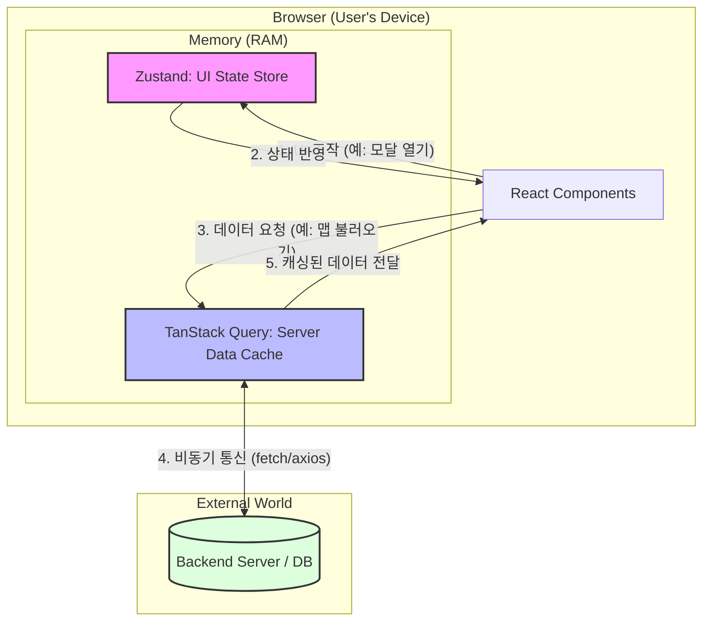

# 📂 기술 설계: 상태 관리 전략 (State Management Strategy)

이 문서는 `EasyMindMap` 프로젝트가 왜 **TanStack Query**와 **Zustand**를 선택했는지, 그리고 초보 개발자도 이해할 수 있는 수준의 동작 원리와 실행 환경에 대해 상세히 기술합니다.

---

## 1. "상태(State)"란 무엇인가?
웹 개발에서 **상태(State)**는 **"시간이 흐름에 따라 변할 수 있는 모든 데이터"**를 의미합니다.
* **예시:** 로그인한 사용자의 이름, 현재 열려있는 마인드맵 노드, 화면의 다크모드 여부 등.
* **비유:** 요리(웹 서비스)를 할 때 필요한 **식재료(데이터)**와 같습니다. 식재료가 신선한지, 어디에 보관되어 있는지 관리하는 것이 바로 **상태 관리**입니다.

---

## 2. 도구별 역할 분담: "배달원"과 "수납장"

본 프로젝트는 데이터의 출처에 따라 역할을 엄격히 분리합니다.

### 🚚 TanStack Query (서버 상태 관리자)
**"서버라는 먼 창고에서 데이터를 가져오는 전문 배달원"**
* **주요 기능:**
    * **Fetching:** 서버 API를 호출하여 데이터를 가져옵니다.
    * **Caching:** 한 번 가져온 데이터는 메모리에 임시 저장하여 중복 요청을 방지합니다.
    * **Synchronization:** 서버의 데이터가 변경되면 화면을 자동으로 최신화합니다.
    * **Status Tracking:** 로딩 중(`isLoading`), 에러 발생(`isError`) 상태를 자동으로 관리합니다.
* **대상 데이터:** 마인드맵 노드 구조, 사용자 프로필, 공유 문서 목록 등 (DB 저장 데이터).

### 🗄️ Zustand (클라이언트 상태 관리자)
**"내 방(브라우저) 안의 물건들을 정리하는 가벼운 수납장"**
* **주요 기능:**
    * **Global Store:** 컴포넌트 간에 데이터를 직접 주고받지 않고, 공용 수납장에서 누구나 꺼내 쓸 수 있게 합니다.
    * **Instant Update:** 서버를 거치지 않으므로 즉각적인 UI 반응을 제공합니다.
    * **Simplicity:** 코드가 매우 직관적이며 설정이 간단합니다.
* **대상 데이터:** 사이드바 개폐 여부, 현재 선택된 노드 ID, 줌 레벨, 에디터 설정 등 (UI 전용 데이터).

---

## 3. 실행 환경 및 기술 스택

### 🌐 실행 환경: 브라우저 메모리 (RAM)
두 솔루션 모두 **사용자의 브라우저(Client-Side)** 내 메모리 공간에서 실행됩니다.
* **공통점:** 새로고침 시 기본적으로 초기화되지만, 브라우저의 전용 공간(RAM)을 효율적으로 점유하여 앱의 속도를 높입니다.
* **차이점:** TanStack Query는 항상 **네트워크(인터넷)** 상태를 주시하며 서버와 소통하는 반면, Zustand는 오직 **사용자의 클릭/입력**에만 반응합니다.

### ⌨️ 사용 언어: JavaScript & TypeScript
본 프로젝트는 **JavaScript**를 기반으로 하되, 안정성을 위해 **TypeScript** 환경에서 실행됩니다.
* **JavaScript:** 브라우저의 기본 언어로, 모든 로직의 뼈대를 이룹니다.
* **TypeScript:** 데이터의 '타입(형태)'을 정의합니다. 예를 들어, 마인드맵 노드가 `string`인지 `number`인지 미리 정의하여 개발자의 실수를 컴파일 단계에서 방지합니다.

---

## 4. 시스템 구조도 (Visualization)

---

## 5. 설계의 기대 효과
1.  **성능 최적화:** TanStack Query의 캐싱 기능을 통해 불필요한 서버 통신을 줄여 비용을 절감하고 속도를 높입니다.
2.  **개발 생산성:** Zustand의 단순한 구조 덕분에 복잡한 상태 전달 과정(Props Drilling)이 사라져 코드 유지보수가 쉬워집니다.
3.  **데이터 안전성:** TypeScript를 활용하여 서버 데이터와 UI 상태의 구조를 명확히 정의함으로써 런타임 에러를 사전에 차단합니다.

---
