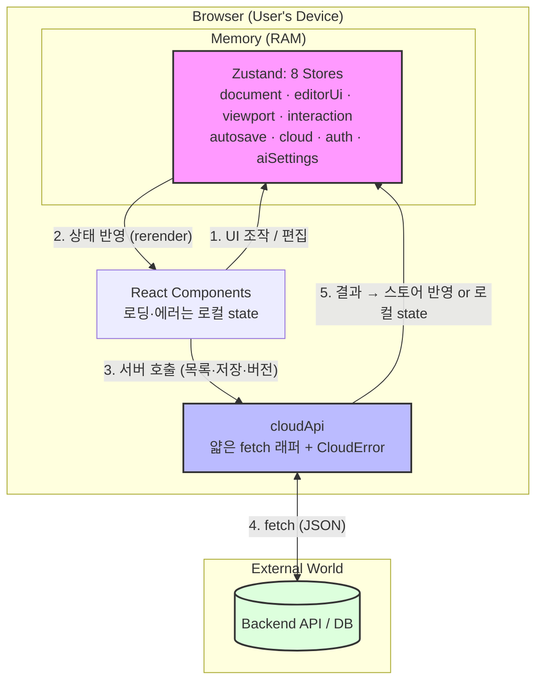

# 📂 기술 설계: 상태 관리 전략 (State Management Strategy)

* 최종 업데이트: 2026-08-04 — TanStack Query 전제 설명을 실제 구현(**Zustand + 얇은 fetch 래퍼 `cloudApi`**, 서버 상태 캐시 라이브러리 미도입)으로 전면 교체.

이 문서는 `EasyMindMap` 프로젝트의 상태 관리가 실제로 어떻게 구성되어
있는지 기술합니다.

---

## 1. "상태(State)"란 무엇인가?

웹 개발에서 **상태(State)**는 **"시간이 흐름에 따라 변할 수 있는 모든 데이터"**를 의미합니다.

* **예시:** 로그인한 사용자, 현재 열려있는 마인드맵 문서, 화면의 다크모드 여부 등.
* **비유:** 요리(웹 서비스)를 할 때 필요한 **식재료(데이터)**와 같습니다. 식재료가 신선한지, 어디에 보관되어 있는지 관리하는 것이 바로 **상태 관리**입니다.

---

## 2. 실제 구성: Zustand + 얇은 fetch 래퍼

본 프로젝트의 상태 관리는 다음 두 층으로만 구성됩니다.

### 🗄️ Zustand (클라이언트 상태 관리자)

**"내 방(브라우저) 안의 물건들을 정리하는 가벼운 수납장"**

* 문서(map)·되돌리기·UI·뷰포트·선택·저장 배지·서버 연결·세션·AI 설정을
  **8개 스토어**로 분리해 관리합니다 — `documentStore` / `editorUiStore` /
  `viewportStore` / `interactionStore` / `autosaveStore` / `cloudStore` /
  `authStore` / `aiSettingsStore`.
* 스토어 상세 구조는 `docs/03-editor-core/state-architecture.md` 참조.

### 🚚 cloudApi (얇은 fetch 래퍼)

**"서버 창고를 오가는 단순한 배달 함수 묶음"**

* 위치: `apps/frontend/src/services/cloud/apiClient.ts`
* 모든 서버 호출(`fetch`)을 `cloudApi` 객체의 함수로 중앙 관리하고,
  실패는 `CloudError`(상태 코드 + 서버 메시지)로 던집니다.
* **TanStack Query 같은 서버 상태 캐시 라이브러리는 도입하지 않았습니다.**
  캐싱·자동 재요청·백그라운드 동기화 계층이 없으며,
  **로딩·에러 표시는 호출하는 컴포넌트의 로컬 state**(`useState`)로
  처리합니다.
* 서버 응답 중 오래 들고 있어야 하는 것(현재 문서, 서버 맵 연결 정보)만
  Zustand 스토어(`documentStore`, `cloudStore`)에 반영합니다.

이 구성이 충분한 이유: 에디터는 "문서 하나를 메모리에 통째로 올려 편집 →
디바운스 저장" 모델이라, 쿼리 캐시·무효화가 관리할 서버 상태가 거의
없습니다. 목록(문서함·히스토리)은 열 때마다 새로 조회하면 충분합니다.

---

## 3. 실행 환경 및 기술 스택

* **실행 환경:** 브라우저 메모리(RAM) — 새로고침 시 스토어는 초기화되고,
  문서는 서버 맵을 다시 열어 복구합니다 (`cloudStore` 는 의도적 비영속).
* **언어:** TypeScript (Vite + React). 데이터의 '타입(형태)'을 정의해
  개발자의 실수를 컴파일 단계에서 줄입니다.

---

## 4. 시스템 구조도 (Visualization)

```mermaid
graph TD
    subgraph "Browser (User's Device)"
        direction TB
        subgraph "Memory (RAM)"
            Z[Zustand: 8 Stores<br/>document · editorUi · viewport · interaction<br/>autosave · cloud · auth · aiSettings]
        end
        API[cloudApi<br/>얇은 fetch 래퍼 + CloudError]
        UI[React Components<br/>로딩·에러는 로컬 state]
    end

    subgraph "External World"
        Server[(Backend API / DB)]
    end

    UI -- "1. UI 조작 / 편집" --> Z
    Z -- "2. 상태 반영 (rerender)" --> UI

    UI -- "3. 서버 호출 (목록·저장·버전)" --> API
    API <--> |"4. fetch (JSON)"| Server
    API -- "5. 결과 → 스토어 반영 or 로컬 state" --> Z

    style Z fill:#f9f,stroke:#333,stroke-width:2px
    style API fill:#bbf,stroke:#333,stroke-width:2px
    style Server fill:#dfd,stroke:#333,stroke-width:2px
```

---

## 5. 설계의 기대 효과

1. **단순성:** 캐시 계층이 없어 데이터 흐름이 "스토어 → 화면, 호출 → 결과" 두 가지뿐입니다.
2. **개발 생산성:** Zustand의 단순한 구조 덕분에 복잡한 상태 전달 과정(Props Drilling)이 사라져 코드 유지보수가 쉬워집니다.
3. **데이터 안전성:** TypeScript로 문서 모델과 API 응답 구조를 정의하고, 오류는 `CloudError` 한 종류로 일관되게 처리합니다.

> (참고) 문서함·히스토리 조회가 훨씬 잦아지거나 협업 V1 에서 실시간
> 동기화가 붙으면, 그때 서버 상태 캐시 라이브러리 도입을 재검토합니다.

---
