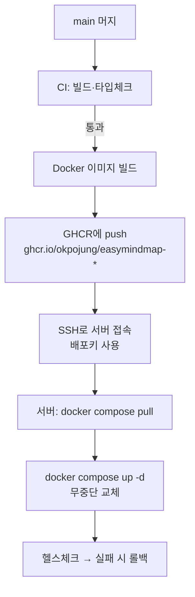

# GitHub Actions로 CI/CD 자동배포 — 처음부터 가이드

> 대상: GitHub Actions를 한 번도 써 본 적 없는 사람.
> 목표: "코드를 푸시하면 GitHub가 알아서 빌드하고, 준비되면 서버까지
> 자동 배포"하는 파이프라인을, **서버에 상시 원격 접속권을 열지 않고**
> 안전하게 구성하는 법을 이해한다.

---

## 0. 한 장 요약

```
개발자가 main에 머지
        │
        ▼
 ┌──────────────────────┐   GitHub이 빌려주는 리눅스 VM(러너)에서
 │  GitHub Actions      │   자동 실행:
 │  (CI → CD 워크플로)   │   ① 빌드·테스트(CI)  ② 배포(CD)
 └──────────────────────┘
        │  배포 단계에서만, Secrets에 저장된 "배포키"로
        ▼  잠깐 서버에 SSH 접속
 ┌──────────────────────┐
 │  내 Ubuntu 22.04 서버 │   docker compose pull && up -d
 └──────────────────────┘
```

핵심 원칙 3가지:

1. **SSH는 GitHub 러너가 한다.** 사람(또는 AI)이 서버에 상시 접속하지
   않는다. 접속권은 GitHub Secrets에 있고, 언제든 회수·감사 가능.
2. **CI와 CD는 분리한다.** CI(빌드·테스트)는 지금 당장, 서버 없이도
   돌릴 수 있다. CD(배포)는 서버가 준비된 뒤 얹는다.
3. **비밀은 절대 코드에 넣지 않는다.** 전부 GitHub Secrets / 서버의
   `.env` 로만.

---

## 1. 용어 — 이것만 알면 된다

| 용어 | 뜻 | 비유 |
|---|---|---|
| **Workflow(워크플로)** | `.github/workflows/*.yml` 파일 하나 = 자동화 시나리오 하나 | 레시피 |
| **Trigger(트리거)** | 워크플로를 언제 돌릴지 (`on:`) — push, pull_request 등 | "손님이 오면" |
| **Job(잡)** | 워크플로 안의 독립 실행 단위. 잡끼리는 기본 병렬 | 요리 코스 |
| **Runner(러너)** | 잡이 실제로 돌아가는 가상머신 (`runs-on: ubuntu-latest`) | 주방 |
| **Step(스텝)** | 잡 안의 한 명령/액션 | 조리 단계 |
| **Action(액션)** | 재사용 가능한 스텝 부품 (`actions/checkout@v4` 등) | 기성 소스 |
| **Secret(시크릿)** | 저장소에 암호로 보관하는 비밀값(SSH키·비밀번호). 로그에 안 찍힘 | 금고 |
| **Environment(환경)** | production 같은 배포 대상 묶음. 승인·보호 규칙을 걸 수 있음 | 출입 통제 구역 |

> **CI** = Continuous Integration = 올라온 코드를 자동 빌드·테스트.
> **CD** = Continuous Deployment = 통과한 코드를 자동으로 서버에 배포.

---

## 2. 지금 단계 — CI부터 (서버 없이 오늘 체험)

이 저장소에는 이미 **CI 워크플로**가 들어와 있습니다:
`.github/workflows/ci.yml`

하는 일: **PR을 올리거나 main에 푸시할 때마다** GitHub이 리눅스 VM을
하나 띄워서

1. 코드를 내려받고 (`checkout`)
2. Node 20 설치 (`setup-node`)
3. `npm ci` 로 의존성 설치
4. `npm run type-check` (타입 오류 검사)
5. `npm run build` (실제 빌드가 깨지지 않는지)

를 자동으로 돌립니다. **하나라도 실패하면 PR에 빨간 X**가 뜨고, 다
통과하면 초록 체크가 뜹니다. 서버가 전혀 필요 없습니다 — 순수하게
"깨진 코드가 main에 들어오는 것"만 막는 품질 게이트입니다.

### 어디서 보나

- 저장소 상단 **Actions** 탭 → 실행 목록·로그
- 각 **PR 하단**의 체크 표시 (Details 클릭 → 로그)

이걸 먼저 며칠 써 보면 "워크플로 = yml 파일, 자동으로 VM에서 돌아감"
이라는 감이 확실히 잡힙니다. **CD(배포)는 이 위에 잡(job) 하나를 더
얹는 것**뿐입니다.

---

## 3. 다음 단계 — CD(자동배포) 큰 그림

배포는 두 가지 흐름이 흔합니다. 우리 스택(Docker Compose + Supabase
self-hosted)에는 **B안(이미지 레지스트리)** 을 권장합니다.

| | A. 서버에서 git pull | B. 이미지 레지스트리(GHCR) ✅ |
|---|---|---|
| 흐름 | 러너가 SSH → 서버에서 `git pull` → 서버가 직접 빌드 | 러너가 이미지 빌드 → GHCR 푸시 → 서버는 `pull`만 |
| 서버 부하 | 서버가 빌드까지(무거움) | 서버는 받기만(가벼움) |
| 롤백 | 어려움 | 이전 이미지 태그로 즉시 |
| 추천 | 소규모 임시 | **운영 권장** |

> **GHCR** = GitHub Container Registry = GitHub이 무료로 주는 도커
> 이미지 저장소(`ghcr.io/okpojung/...`). 별도 가입 불필요.

### B안 전체 파이프라인



---

## 4. 서버 사전 준비 (Ubuntu 22.04) — 한 번만

아래는 **당신이 서버에서 직접** 실행합니다. (저는 이 명령들을 만들어
드리고, 당신이 붙여넣기 실행 → 출력 공유하면 함께 점검합니다.)

### 4-1. Docker & Compose 설치

```bash
# Docker 공식 스크립트
curl -fsSL https://get.docker.com | sudo sh
sudo usermod -aG docker $USER   # 로그아웃 후 재로그인해야 적용
docker --version && docker compose version
```

### 4-2. 배포 전용 사용자·디렉토리 (권장)

```bash
sudo adduser --disabled-password --gecos "" deploy
sudo usermod -aG docker deploy
sudo mkdir -p /opt/easymindmap && sudo chown deploy:deploy /opt/easymindmap
```

- 배포 관련 파일(`docker-compose.yml`, `.env`)은 `/opt/easymindmap`에.
- `.env`(비밀값)는 **서버에만** 두고 git에는 절대 올리지 않습니다.

### 4-3. 방화벽 — 필요한 포트만

```bash
sudo ufw allow OpenSSH        # 22 (SSH)
sudo ufw allow 80,443/tcp     # 웹(Nginx)
sudo ufw enable
sudo ufw status
```

> ⚠️ 이전에 지적된 **RDP(3389) 같은 불필요 포트는 반드시 차단**하세요.
> DB(5432)·Redis(6379)·Supabase 내부 포트는 **외부에 열지 말고** 컴포즈
> 내부 네트워크로만 통신합니다.

---

## 5. 인증 연결 — SSH 배포키 (가장 헷갈리는 부분, 천천히)

목표: **GitHub 러너 → 서버**로만 접속되는 전용 키를 만들고, GitHub
금고(Secrets)에 넣습니다. 당신 개인 노트북 키는 절대 쓰지 않습니다.

### 5-1. 배포 전용 키쌍 생성 (당신 PC 또는 서버에서)

```bash
ssh-keygen -t ed25519 -C "gh-actions-deploy" -f ~/emm_deploy_key -N ""
# 결과 2개:
#  ~/emm_deploy_key      (개인키 — GitHub Secret으로)
#  ~/emm_deploy_key.pub  (공개키 — 서버에 등록)
```

### 5-2. 공개키를 서버 deploy 계정에 등록

```bash
# 서버에서 (deploy 사용자로):
mkdir -p ~/.ssh && chmod 700 ~/.ssh
echo "<emm_deploy_key.pub 내용 붙여넣기>" >> ~/.ssh/authorized_keys
chmod 600 ~/.ssh/authorized_keys
```

### 5-3. 개인키·접속정보를 GitHub Secrets에 등록

저장소 → **Settings → Secrets and variables → Actions → New repository
secret**. 아래를 각각 등록:

| Secret 이름 | 값 | 예 |
|---|---|---|
| `DEPLOY_SSH_KEY` | `~/emm_deploy_key` (개인키) **전체** | `-----BEGIN OPENSSH...` |
| `DEPLOY_HOST` | 서버 공인 IP 또는 도메인 | `mindmap.example.com` |
| `DEPLOY_USER` | 배포 계정 | `deploy` |
| `DEPLOY_PORT` | SSH 포트(기본 22) | `22` |

> 🔒 Secret은 등록 후 **다시 볼 수 없고**(수정만), 로그에도 `***`로
> 가려집니다. 개인키가 git에 커밋되는 일은 절대 없어야 합니다.

### 5-4. (권장) production 환경 + 수동 승인

Settings → **Environments → New environment → `production`** →
"Required reviewers"에 본인 추가. 이러면 **배포 직전 당신이 버튼을
눌러 승인**해야 진행됩니다(실수 방지). 위 Secret들을 이 환경에 넣으면
승인 없이는 접근조차 안 됩니다.

---

## 6. 배포 워크플로 예시 (서버 준비되면 추가)

아직 커밋하지 않습니다. 서버·Secrets가 준비되면 `.github/workflows/
deploy.yml`로 추가합니다. 아래는 **B안**(GHCR) 골격입니다.

```yaml
name: Deploy
on:
  push:
    branches: [main]        # main 머지 시 자동 (원하면 workflow_dispatch로 수동만)

concurrency: { group: deploy-production, cancel-in-progress: false }

jobs:
  build-and-push:
    runs-on: ubuntu-latest
    permissions: { contents: read, packages: write }   # GHCR 푸시 권한
    steps:
      - uses: actions/checkout@v4
      - uses: docker/login-action@v3
        with:
          registry: ghcr.io
          username: ${{ github.actor }}
          password: ${{ secrets.GITHUB_TOKEN }}         # 자동 제공(등록 불필요)
      - uses: docker/build-push-action@v6
        with:
          context: ./apps/frontend
          push: true
          tags: ghcr.io/okpojung/easymindmap-frontend:latest

  deploy:
    needs: build-and-push
    runs-on: ubuntu-latest
    environment: production            # ← 수동 승인 게이트(5-4)
    steps:
      - name: 서버에 SSH → 컴포즈 갱신
        uses: appleboy/ssh-action@v1
        with:
          host: ${{ secrets.DEPLOY_HOST }}
          username: ${{ secrets.DEPLOY_USER }}
          port: ${{ secrets.DEPLOY_PORT }}
          key: ${{ secrets.DEPLOY_SSH_KEY }}
          script: |
            cd /opt/easymindmap
            docker compose pull
            docker compose up -d
            docker image prune -f
```

> 백엔드(`apps/api`)가 생기면 build-push 스텝을 하나 더 추가해 API
> 이미지도 같이 빌드·배포합니다.

---

## 7. 보안 체크리스트

- [ ] 배포키는 **전용 키쌍**(개인 키 재사용 금지), 서버의 `deploy`
      계정에만 등록, 가능하면 `command=` 제한.
- [ ] 모든 비밀은 **GitHub Secrets** 또는 서버 `.env`. 코드·로그·PR에
      절대 노출 금지. `.env`는 `.gitignore`에 이미 포함.
- [ ] `production` **Environment + Required reviewers**로 배포 전 승인.
- [ ] 방화벽: 22/80/443만. **RDP·DB·Redis 외부 노출 금지.**
- [ ] 이미지 태그에 커밋 SHA도 같이 붙여 롤백 지점 확보
      (`:latest` + `:sha-xxxxxxx`).
- [ ] Actions 권한 최소화(`permissions:` 명시), 서드파티 액션은 버전
      고정(`@v1`이 아니라 필요시 SHA 핀).

---

## 8. 롤백

```bash
# 서버에서 — 직전 정상 태그로 되돌리기
cd /opt/easymindmap
docker compose pull easymindmap-frontend:sha-<이전커밋>
docker compose up -d
```

또는 GitHub에서 직전 정상 커밋으로 `git revert` → main 푸시 → 파이프라인
재실행(가장 안전, 이력 남음).

---

## 9. 트러블슈팅

| 증상 | 원인 · 해결 |
|---|---|
| `Permission denied (publickey)` | 공개키가 서버 `authorized_keys`에 없거나 권한(`700/600`) 문제. `DEPLOY_USER` 확인 |
| `Host key verification failed` | ssh-action은 자동 처리. 수동 SSH면 `ssh-keyscan`으로 known_hosts 등록 |
| GHCR `denied` | 잡 `permissions: packages: write` 누락, 또는 패키지가 private라 서버가 못 받음 → 패키지 public 또는 서버 `docker login ghcr.io` |
| CI는 되는데 서버에 반영 안 됨 | `docker compose pull`이 새 이미지를 못 가져옴 — 태그가 `latest` 그대로면 `--pull always` 또는 SHA 태그 사용 |
| Secret이 `***`로만 보임 | 정상. 값 확인 불가, 수정만 가능 |

---

## 10. 우리 프로젝트 진행 순서

1. **[지금] CI 가동** — `ci.yml`로 매 PR 빌드·타입체크. Actions 탭에서
   초록불 체험. (이 문서 §2)
2. **[백엔드 착수 후] 이미지화** — 프론트/`apps/api`에 `Dockerfile`,
   루트에 운영용 `docker-compose.yml` 작성.
3. **[서버 준비] 사전 세팅** — §4 서버 준비 + §5 배포키·Secrets.
4. **[연결] deploy.yml 추가** — §6 워크플로. 처음엔 `workflow_dispatch`
   (수동 버튼)로 시작해 몇 번 검증 후 `push: main` 자동으로 전환.
5. **[안정화] 헬스체크·롤백·모니터링** 보강.

> 급하게 공개할 필요 없다는 방침에 맞춰, **1번(CI)만 먼저** 켜고
> 나머지는 백엔드가 준비되면 단계적으로 얹습니다.

---

_관련 문서: `infra-architecture.md`(서버/네트워크), `docker-compose-spec.md`
(서비스 구성), `backend-architecture.md`(NestJS+Supabase), `env-spec.md`
(환경변수)._
