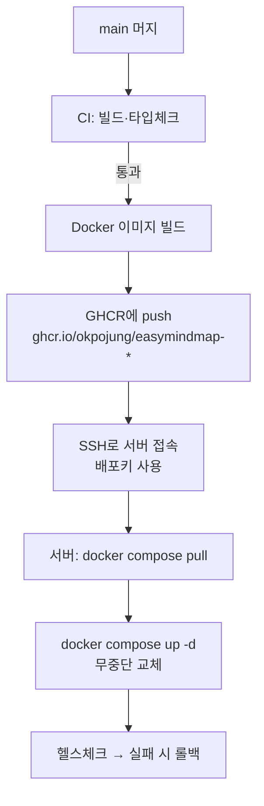

# GitHub Actions로 CI/CD 자동배포 — 처음부터 가이드

> 대상: GitHub Actions를 한 번도 써 본 적 없는 사람.
> 목표: "코드를 푸시하면 GitHub가 알아서 빌드하고, 준비되면 서버까지
> 자동 배포"하는 파이프라인을, **서버에 상시 원격 접속권을 열지 않고**
> 안전하게 구성하는 법을 이해한다.
>
> **⚡ 운영 배포 방식 확정 (2026-09-06 사용자 결정) — B안.**
> **개발 서버(dev)는 지금처럼 Coolify** 가 소스에서 빌드·배포한다
> ([`dev-server-coolify.md`](dev-server-coolify.md)). **운영 서버에는 Coolify 를
> 설치하지 않는다.** 운영은 이 문서 §3 의 **B안** — GitHub Actions 러너가
> **불변 이미지**를 만들어 GHCR 에 태그로 올리고, 운영 서버는 그 이미지를
> **당겨서(pull)** 띄운다. 운영 구조 전체는 **§11** 에 있다.
>
> 왜 B 인가 (2026-09-06 검토): ⑴ 클라우드(AWS 등) 이전 시 레지스트리 주소만
> 바뀐다 ⑵ "재배포는 성공인데 옛 코드"(dev 트러블슈팅 ★★)가 구조적으로
> 사라진다 — 태그가 곧 내용이다 ⑶ 셀프호스트 제품
> ([`selfhost-docker.md`](selfhost-docker.md) §9 ①②)이 없다고 한 조각
> (Dockerfile · compose · 레지스트리)이 그대로 생긴다 ⑷ 운영 서버가 빌드하지
> 않는다 — 빌드 캐시·CPU 를 사용자 트래픽과 나누지 않는다.
>
> 이전 결정(2026-07 "CD 는 Coolify, 프로덕션도 Coolify") 은 **dev 에만**
> 남는다. dev 도 나중에 같은 이미지를 띄우는 쪽으로 바꿀 수 있다(§11.6).
>
> ⚠️ **IP 는 문서용 예시**(사설 `192.168.0.x` · 공인 `203.0.113.x`)이고,
> **도메인은 실제 값**이다(`*.mindmap.ai.kr`). 남아 있는 `*.example.com` 은
> 아직 정하지 않은 주소이거나 일반 예시다 — 자세한 근거는
> [`infra-architecture.md`](infra-architecture.md) 상단.

---

## 0. 한 장 요약

```
개발자가 main에 머지
        │
        ▼
 ┌──────────────────────┐   GitHub이 빌려주는 리눅스 VM(러너)에서
 │  GitHub Actions      │   자동 실행:
 │  (CI → CD 워크플로)   │   ① 빌드·테스트(CI)  ② 배포(CD)
 └──────────────────────┘
        │  배포 단계에서만, Secrets에 저장된 "배포키"로
        ▼  잠깐 서버에 SSH 접속
 ┌──────────────────────┐
 │  내 Ubuntu 24.04 서버 │   docker compose pull && up -d
 └──────────────────────┘
```

핵심 원칙 3가지:

1. **SSH는 GitHub 러너가 한다.** 사람(또는 AI)이 서버에 상시 접속하지
   않는다. 접속권은 GitHub Secrets에 있고, 언제든 회수·감사 가능.
2. **CI와 CD는 분리한다.** CI(빌드·테스트)는 지금 당장, 서버 없이도
   돌릴 수 있다. CD(배포)는 서버가 준비된 뒤 얹는다.
3. **비밀은 절대 코드에 넣지 않는다.** 전부 GitHub Secrets / 서버의
   `.env` 로만.

---

## 1. 용어 — 이것만 알면 된다

| 용어 | 뜻 | 비유 |
|---|---|---|
| **Workflow(워크플로)** | `.github/workflows/*.yml` 파일 하나 = 자동화 시나리오 하나 | 레시피 |
| **Trigger(트리거)** | 워크플로를 언제 돌릴지 (`on:`) — push, pull_request 등 | "손님이 오면" |
| **Job(잡)** | 워크플로 안의 독립 실행 단위. 잡끼리는 기본 병렬 | 요리 코스 |
| **Runner(러너)** | 잡이 실제로 돌아가는 가상머신 (`runs-on: ubuntu-latest`) | 주방 |
| **Step(스텝)** | 잡 안의 한 명령/액션 | 조리 단계 |
| **Action(액션)** | 재사용 가능한 스텝 부품 (`actions/checkout@v4` 등) | 기성 소스 |
| **Secret(시크릿)** | 저장소에 암호로 보관하는 비밀값(SSH키·비밀번호). 로그에 안 찍힘 | 금고 |
| **Environment(환경)** | production 같은 배포 대상 묶음. 승인·보호 규칙을 걸 수 있음 | 출입 통제 구역 |

> **CI** = Continuous Integration = 올라온 코드를 자동 빌드·테스트.
> **CD** = Continuous Deployment = 통과한 코드를 자동으로 서버에 배포.

---

## 2. 지금 단계 — CI부터 (서버 없이 오늘 체험)

이 저장소에는 이미 **CI 워크플로**가 들어와 있습니다:
`.github/workflows/ci.yml`

하는 일: **PR을 올리거나 main에 푸시할 때마다** GitHub이 리눅스 VM을
하나 띄워서

1. 코드를 내려받고 (`checkout`)
2. Node 20 설치 (`setup-node`)
3. `npm ci` 로 의존성 설치
4. `npm run type-check` (타입 오류 검사)
5. `npm run build` (실제 빌드가 깨지지 않는지)

를 자동으로 돌립니다. **하나라도 실패하면 PR에 빨간 X**가 뜨고, 다
통과하면 초록 체크가 뜹니다. 서버가 전혀 필요 없습니다 — 순수하게
"깨진 코드가 main에 들어오는 것"만 막는 품질 게이트입니다.

### 어디서 보나

- 저장소 상단 **Actions** 탭 → 실행 목록·로그
- 각 **PR 하단**의 체크 표시 (Details 클릭 → 로그)

이걸 먼저 며칠 써 보면 "워크플로 = yml 파일, 자동으로 VM에서 돌아감"
이라는 감이 확실히 잡힙니다. **CD(배포)는 이 위에 잡(job) 하나를 더
얹는 것**뿐입니다.

---

## 3. 다음 단계 — CD(자동배포) 큰 그림

배포는 두 가지 흐름이 흔합니다. 우리 스택(Docker Compose + Supabase
self-hosted)에는 **B안(이미지 레지스트리)** 을 권장합니다.

| | A. 서버에서 git pull | B. 이미지 레지스트리(GHCR) ✅ |
|---|---|---|
| 흐름 | 러너가 SSH → 서버에서 `git pull` → 서버가 직접 빌드 | 러너가 이미지 빌드 → GHCR 푸시 → 서버는 `pull`만 |
| 서버 부하 | 서버가 빌드까지(무거움) | 서버는 받기만(가벼움) |
| 롤백 | 어려움 | 이전 이미지 태그로 즉시 |
| 추천 | 소규모 임시 | **운영 권장** |

> **GHCR** = GitHub Container Registry = GitHub 계정에 딸린 도커 이미지
> 저장소(`ghcr.io/okpojung/...`). 별도 가입 불필요. **public 저장소의
> 이미지는 무료·무제한**, private(`easymindmap-pro`)은 요금제 한도를 쓴다 —
> **GitHub Pro(월 4달러): 저장 2 GB · 전송 10 GB/월** (2026-09-06 사용자 확인).
> Free 는 500 MB · 1 GB 라 유료판 이미지(약 150~200 MB)에는 빠듯하다.
> 러너가 올리는 전송은 세지 않고 **운영 서버가 내려받는 것만** 센다.

### B안 전체 파이프라인



---

## 4. 서버 사전 준비 (Ubuntu 24.04) — 한 번만

아래는 **당신이 서버에서 직접** 실행합니다. (저는 이 명령들을 만들어
드리고, 당신이 붙여넣기 실행 → 출력 공유하면 함께 점검합니다.)

### 4-1. Docker & Compose 설치

```bash
# Docker 공식 스크립트
curl -fsSL https://get.docker.com | sudo sh
sudo usermod -aG docker $USER   # 로그아웃 후 재로그인해야 적용
docker --version && docker compose version
```

### 4-2. 배포 전용 사용자·디렉토리 (권장)

```bash
sudo adduser --disabled-password --gecos "" deploy
sudo usermod -aG docker deploy
sudo mkdir -p /opt/easymindmap && sudo chown deploy:deploy /opt/easymindmap
```

- 배포 관련 파일(`docker-compose.yml`, `.env`)은 `/opt/easymindmap`에.
- `.env`(비밀값)는 **서버에만** 두고 git에는 절대 올리지 않습니다.

### 4-3. 방화벽 — 필요한 포트만

```bash
sudo ufw allow OpenSSH        # 22 (SSH)
sudo ufw allow 80,443/tcp     # 웹(Nginx)
sudo ufw enable
sudo ufw status
```

> ⚠️ 이전에 지적된 **RDP(3389) 같은 불필요 포트는 반드시 차단**하세요.
> DB(5432)·Redis(6379)·Supabase 내부 포트는 **외부에 열지 말고** 컴포즈
> 내부 네트워크로만 통신합니다.

---

## 5. 인증 연결 — SSH 배포키 (가장 헷갈리는 부분, 천천히)

목표: **GitHub 러너 → 서버**로만 접속되는 전용 키를 만들고, GitHub
금고(Secrets)에 넣습니다. 당신 개인 노트북 키는 절대 쓰지 않습니다.

### 5-1. 배포 전용 키쌍 생성 (당신 PC 또는 서버에서)

```bash
ssh-keygen -t ed25519 -C "gh-actions-deploy" -f ~/emm_deploy_key -N ""
# 결과 2개:
#  ~/emm_deploy_key      (개인키 — GitHub Secret으로)
#  ~/emm_deploy_key.pub  (공개키 — 서버에 등록)
```

### 5-2. 공개키를 서버 deploy 계정에 등록

```bash
# 서버에서 (deploy 사용자로):
mkdir -p ~/.ssh && chmod 700 ~/.ssh
echo "<emm_deploy_key.pub 내용 붙여넣기>" >> ~/.ssh/authorized_keys
chmod 600 ~/.ssh/authorized_keys
```

### 5-3. 개인키·접속정보를 GitHub Secrets에 등록

저장소 → **Settings → Secrets and variables → Actions → New repository
secret**. 아래를 각각 등록:

| Secret 이름 | 값 | 예 |
|---|---|---|
| `DEPLOY_SSH_KEY` | `~/emm_deploy_key` (개인키) **전체** | `-----BEGIN OPENSSH...` |
| `DEPLOY_HOST` | 서버 공인 IP 또는 도메인 | `mindmap.example.com` |
| `DEPLOY_USER` | 배포 계정 | `deploy` |
| `DEPLOY_PORT` | SSH 포트(기본 22) | `22` |

> 🔒 Secret은 등록 후 **다시 볼 수 없고**(수정만), 로그에도 `***`로
> 가려집니다. 개인키가 git에 커밋되는 일은 절대 없어야 합니다.

### 5-4. (권장) production 환경 + 수동 승인

Settings → **Environments → New environment → `production`** →
"Required reviewers"에 본인 추가. 이러면 **배포 직전 당신이 버튼을
눌러 승인**해야 진행됩니다(실수 방지). 위 Secret들을 이 환경에 넣으면
승인 없이는 접근조차 안 됩니다.

---

## 6. 배포 워크플로 예시 (서버 준비되면 추가)

> **2026-09-06 개정**: 아래 골격은 **공개 코어(프런트) 하나를 main 푸시마다
> 빌드해 SSH 로 밀어 넣는** 첫 설계다. 확정된 운영 구조에서는 세 가지가
> 다르다 — ⑴ 운영에 올라가는 것은 **유료판 이미지**이고 그 Dockerfile 은
> private 저장소에 있으므로 **워크플로도 `easymindmap-pro` 에** 둔다 ⑵ 트리거는
> main 푸시가 아니라 **태그(`v*`)** 다 — 운영은 태그·수동 배포가 원칙이다
> ⑶ 배포는 러너가 SSH 로 미는 것이 아니라 **운영 서버가 당긴다**(§11.4).
> 실제 워크플로 설계는 **§11.3** 에 있다. 아래는 개념 이해용으로 남긴다.

아직 커밋하지 않습니다. 서버·Secrets가 준비되면 `.github/workflows/
deploy.yml`로 추가합니다. 아래는 **B안**(GHCR) 골격입니다.

```yaml
name: Deploy
on:
  push:
    branches: [main]        # main 머지 시 자동 (원하면 workflow_dispatch로 수동만)

concurrency: { group: deploy-production, cancel-in-progress: false }

jobs:
  build-and-push:
    runs-on: ubuntu-latest
    permissions: { contents: read, packages: write }   # GHCR 푸시 권한
    steps:
      - uses: actions/checkout@v4
      - uses: docker/login-action@v3
        with:
          registry: ghcr.io
          username: ${{ github.actor }}
          password: ${{ secrets.GITHUB_TOKEN }}         # 자동 제공(등록 불필요)
      - uses: docker/build-push-action@v6
        with:
          context: ./apps/frontend
          push: true
          tags: ghcr.io/okpojung/easymindmap-frontend:latest

  deploy:
    needs: build-and-push
    runs-on: ubuntu-latest
    environment: production            # ← 수동 승인 게이트(5-4)
    steps:
      - name: 서버에 SSH → 컴포즈 갱신
        uses: appleboy/ssh-action@v1
        with:
          host: ${{ secrets.DEPLOY_HOST }}
          username: ${{ secrets.DEPLOY_USER }}
          port: ${{ secrets.DEPLOY_PORT }}
          key: ${{ secrets.DEPLOY_SSH_KEY }}
          script: |
            cd /opt/easymindmap
            docker compose pull
            docker compose up -d
            docker image prune -f
```

> 백엔드(`apps/api`)가 생기면 build-push 스텝을 하나 더 추가해 API
> 이미지도 같이 빌드·배포합니다.

---

## 7. 보안 체크리스트

- [ ] 배포키는 **전용 키쌍**(개인 키 재사용 금지), 서버의 `deploy`
      계정에만 등록, 가능하면 `command=` 제한.
- [ ] 모든 비밀은 **GitHub Secrets** 또는 서버 `.env`. 코드·로그·PR에
      절대 노출 금지. `.env`는 `.gitignore`에 이미 포함.
- [ ] `production` **Environment + Required reviewers**로 배포 전 승인.
- [ ] 방화벽: 22/80/443만. **RDP·DB·Redis 외부 노출 금지.**
- [ ] 이미지 태그에 커밋 SHA도 같이 붙여 롤백 지점 확보
      (`:latest` + `:sha-xxxxxxx`).
- [ ] Actions 권한 최소화(`permissions:` 명시), 서드파티 액션은 버전
      고정(`@v1`이 아니라 필요시 SHA 핀).

---

## 8. 롤백

```bash
# 서버에서 — 직전 정상 태그로 되돌리기
cd /opt/easymindmap
docker compose pull easymindmap-frontend:sha-<이전커밋>
docker compose up -d
```

또는 GitHub에서 직전 정상 커밋으로 `git revert` → main 푸시 → 파이프라인
재실행(가장 안전, 이력 남음).

---

## 9. 트러블슈팅

| 증상 | 원인 · 해결 |
|---|---|
| `Permission denied (publickey)` | 공개키가 서버 `authorized_keys`에 없거나 권한(`700/600`) 문제. `DEPLOY_USER` 확인 |
| `Host key verification failed` | ssh-action은 자동 처리. 수동 SSH면 `ssh-keyscan`으로 known_hosts 등록 |
| GHCR `denied` | 잡 `permissions: packages: write` 누락, 또는 패키지가 private라 서버가 못 받음 → 패키지 public 또는 서버 `docker login ghcr.io` |
| CI는 되는데 서버에 반영 안 됨 | `docker compose pull`이 새 이미지를 못 가져옴 — 태그가 `latest` 그대로면 `--pull always` 또는 SHA 태그 사용 |
| Secret이 `***`로만 보임 | 정상. 값 확인 불가, 수정만 가능 |

---

## 10. 우리 프로젝트 진행 순서 (2026-09-06 개정 — 운영은 B안)

1. ✅ **CI 가동** — `ci.yml`로 매 PR 빌드·타입체크·백엔드 스모크(DB).
   품질 게이트로 계속 유지. (이 문서 §2)
2. ✅ **백엔드·클라우드 저장 구현** — `apps/api` + 프론트 연결 완료.
3. ✅ **개발 서버 구축** (2026-08-01) — Ubuntu + **Coolify**, main 푸시 =
   자동 배포. 지금은 유료판 한 벌(`easymindmap-api-pro` ·
   `easymindmap-frontend-pro`)이 돈다. → [`dev-server-coolify.md`](dev-server-coolify.md)
4. **[다음] 유료판 이미지 빌드 워크플로** — `easymindmap-pro` 에
   `.github/workflows/release.yml`: 태그 `v*` 를 찍으면 API·프런트 이미지를
   빌드해 GHCR 에 올린다(§11.3). **서버가 없어도 오늘 할 수 있다.**
5. **[운영 VM 을 세울 때] 운영 서버 구성** — VM-02 에 Docker + compose +
   배포 스크립트 + Portainer CE, VM-03 에 네이티브 PostgreSQL 16 (§11 ·
   [`infra-architecture.md`](infra-architecture.md) §8-A·§10).
6. **[안정화] 헬스체크·백업·모니터링** — `health-watch.sh` ·
   `emm-db-backup.sh`(네이티브 PG 분기 필요) + `infra-architecture.md` §15~16.

---

## 11. 운영 서버 구조 — 확정 (2026-09-06 사용자 결정)

### 11.1 층 구조

```
Dev  (VM-DEV)   OS > Docker > Coolify(컨테이너) > [PostgreSQL · API · Web · GoTrue · Traefik]  전부 컨테이너
운영 (VM-02)    OS > Docker > [API-pro · Web-pro · GoTrue · Portainer]                      ← Coolify 없음
운영 (VM-03)    OS > PostgreSQL 16 네이티브 (apt · systemd)                                  ← Docker 없음
운영 (VM-05)    OS > Docker > [워커]  (예정)
앞단            NPM(192.168.0.74) 이 TLS 를 끝내고 VM-02 의 컨테이너 포트로 직접 넘긴다 (3000 · 80 · 9999)
```

- **운영에는 Coolify 도 Traefik 도 없다.** dev 에서 겪은 "NPM Forward 포트는
  80(Traefik)" 함정이 운영에는 없다 — NPM 이 컨테이너 포트를 직접 가리킨다.
- **DB 는 네이티브다.** Docker 층을 빼 튜닝·PITR 도구(pgBackRest)·OS 백업이
  단순해진다. API 는 `DATABASE_URL` 에 **VM-03 의 IP** 를 적어 붙는다
  (컨테이너 내부 이름이 아니다).
- **운영에 올라가는 것은 유료판 이미지**뿐이다(private 저장소 `docs/deploy.md`
  §6.4 — 공개 스택과 DB 를 함께 쓰지 않는다).

### 11.2 도구 분담 — dev 에서 Coolify 가 하던 일이 어디로 가나

| Coolify 가 하던 일 | 운영에서는 |
|---|---|
| 빌드 | **GitHub Actions 러너** (§11.3) — 운영 서버는 빌드 도구(Node·소스)가 없다 |
| 배포·롤백 | 서버의 `docker-compose.yml` + `emm-deploy.sh` (§11.4). 롤백 = 이전 태그로 같은 스크립트 |
| 환경변수 | 서버의 `/opt/easymindmap/.env` (권한 600, root 소유) |
| 프록시·TLS | 기존 **NPM** (Access List · Let's Encrypt 그대로) |
| 컨테이너 보기·로그·재시작·셸 | **Portainer CE** (§11.5) — **보기·재시작·로그**에 한정. 배포는 스크립트로만 |
| DB 백업 | `scripts/emm-db-backup.sh` — 지금은 `docker exec` 로 컨테이너 안 `pg_dumpall` 을 부른다. **네이티브 분기**(로컬 `pg_dumpall`)를 넣어야 한다 (백로그 B20 ⑤) |
| 헬스 감시 | `scripts/health-watch.sh` 그대로 |

### 11.3 1단계 — 유료판 이미지 빌드 (`easymindmap-pro` 저장소, 태그 트리거)

Dockerfile 두 개(`/Dockerfile` API · `/Dockerfile.frontend`)는 private 저장소에
이미 있고 코어를 `ARG CORE_SHA` 로 고정해 얹는다(private `docs/deploy.md` §2).
워크플로는 그 빌드를 **러너에서** 돌려 GHCR 에 올리는 것뿐이다.

```yaml
# easymindmap-pro/.github/workflows/release.yml  (설계 — 아직 커밋 전)
name: Release images
on:
  push:
    tags: ['v*']            # git tag v1.2.3 && git push --tags → 이 워크플로만 돈다
  workflow_dispatch:        # 손으로도 돌릴 수 있게

permissions: { contents: read, packages: write }   # GHCR 푸시 권한 — 토큰 등록 불필요

jobs:
  api:
    runs-on: ubuntu-latest
    steps:
      - uses: actions/checkout@v4
      - uses: docker/login-action@v3
        with: { registry: ghcr.io, username: ${{ github.actor }}, password: ${{ secrets.GITHUB_TOKEN }} }
      - uses: docker/build-push-action@v6
        with:
          context: .
          file: Dockerfile
          push: true
          tags: |
            ghcr.io/okpojung/easymindmap-api-pro:${{ github.ref_name }}
            ghcr.io/okpojung/easymindmap-api-pro:sha-${{ github.sha }}
  frontend:
    runs-on: ubuntu-latest
    steps:
      - uses: actions/checkout@v4
      - uses: docker/login-action@v3
        with: { registry: ghcr.io, username: ${{ github.actor }}, password: ${{ secrets.GITHUB_TOKEN }} }
      - uses: docker/build-push-action@v6
        with:
          context: .
          file: Dockerfile.frontend
          push: true
          build-args: |
            VITE_API_URL=${{ vars.PROD_API_URL }}
            VITE_SUPABASE_URL=${{ vars.PROD_AUTH_URL }}
            VITE_SUPABASE_ANON_KEY=not-used
            VITE_SUPABASE_AUTH_PREFIX=/
          tags: |
            ghcr.io/okpojung/easymindmap-frontend-pro:${{ github.ref_name }}
            ghcr.io/okpojung/easymindmap-frontend-pro:sha-${{ github.sha }}
```

지킬 것 넷.

- **태그는 곧 내용이다.** 같은 태그를 다시 올리지 않는다(불변). 고치면 새 태그.
- **`VITE_*` 는 빌드 시점에 번들에 박힌다**(dev 가이드 함정). 그래서 프런트
  이미지는 **운영 주소가 박힌 운영 전용 이미지**다. dev 용은 값이 다르므로
  따로 빌드하거나, 런타임 `config.js` 자리를 먼저 만든다
  ([`selfhost-docker.md`](selfhost-docker.md) §9 ②). 화이트라벨까지 가면 후자가 맞다.
- **용량 관리**: 저장 2 GB 안에 들도록 API 이미지에서 devDependencies 를
  빼고(`npm ci --omit=dev` — 이미 그렇다), 워크플로 끝에 "최근 5개 태그만 남긴다"
  단계를 넣는다(`actions/delete-package-versions`). `sha-` 태그는 롤백
  지점이므로 같이 관리한다.
- **빌드 안에서 `require('@easymindmap/pro')` 확인**은 Dockerfile 이 이미 한다 —
  실패하면 이미지가 안 만들어진다. 이 검사를 빼지 않는다.

### 11.4 2단계 — 운영 서버가 당긴다 (pull 방식)

러너가 SSH 로 IDC 안으로 들어오지 않는다. **운영 서버가 GHCR 로 나가서**
가져온다 — 방화벽에 인바운드를 열 것이 없다.

```
/opt/easymindmap/
├── docker-compose.yml     # api-pro · frontend-pro · gotrue · portainer (이미지 태그는 .env 에서)
├── .env                   # IMAGE_TAG=v1.2.3 · DATABASE_URL=postgres://…@192.168.0.113:5432/postgres · SMTP_* · …  (600)
└── emm-deploy.sh          # 아래 순서
```

`emm-deploy.sh v1.2.3` 의 순서:

1. `docker login ghcr.io` (읽기 전용 PAT · `packages:read` 만)
2. `.env` 의 `IMAGE_TAG` 를 바꾸고 `docker compose pull`
3. **스키마 델타** — `docker compose run --rm api-pro node scripts/apply-schema.mjs`
   (멱등. 코드가 먼저, 표는 나중이라는 순서는 코어 런북 §1.5-0-I 그대로)
4. `docker compose up -d` — 이미지가 바뀐 컨테이너만 교체된다
5. `curl -fs http://127.0.0.1:3000/v1/health` — `status:ok` 가 아니면 **직전
   태그로 2→4 를 되돌린다**(롤백이 곧 같은 스크립트다)
6. `docker image prune -a --filter until=168h` — 볼륨은 건드리지 않는다

트리거는 **사람**이다: 태그를 찍고, 러너가 이미지를 올린 것을 확인한 뒤,
운영 서버에서 스크립트를 실행한다. 자동화가 필요해지면 **self-hosted
러너를 VM-DEV 에** 두고 그 러너가 VM-02 로 SSH 하게 한다 — 그래도 GitHub 이
IDC 로 들어오는 길은 없다.

### 11.5 운영 관리 도구 — Portainer CE

dev 에서 Coolify 화면으로 하던 **"컨테이너 보기·로그·재시작·셸"** 의 자리다.

| | 값 |
|---|---|
| 어디에 | VM-02 에 컨테이너 하나 (`portainer/portainer-ce`). VM-05 가 생기면 **에이전트**를 하나 더 띄워 한 화면에서 둘을 본다 |
| 접근 | 내부 IP 에만 바인딩 + NPM Access List **IPSec-VPN-Only** (관리자 콘솔과 같은 규칙). CE 판에는 2단계 인증이 없으므로 **네트워크가 방벽**이다 |
| 권한 | `docker.sock` 을 잡는다 = **root 와 같다.** 사용자는 관리자 한 명 |
| 하지 않는 것 | **배포·compose 편집**. 두 곳에서 손대면 어느 것이 진짜인지 모른다. 배포는 §11.4 스크립트로만 |

Dockge(compose 중심·단일 호스트)도 후보였으나 호스트가 둘이 되는 시점과
셀프호스트 납품 고객에게 같은 도구를 안내할 수 있다는 점에서 Portainer 를
골랐다.

처음부터 넣어 둘 작은 것 셋: Docker 로그 순환(`/etc/docker/daemon.json` 의
`log-opts: {max-size: 50m, max-file: 5}` — 안 넣으면 로그가 디스크를 채운다),
옛 이미지 정리 cron(§11.4 ⑥), compose 의 `restart: unless-stopped`(재부팅 뒤
자동 기동).

### 11.6 dev 는 어떻게 되나

지금 그대로 — Coolify 가 소스에서 빌드한다. 다만 §11.3 이 돌기 시작하면
dev 의 `easymindmap-api-pro` 를 **Docker Image 리소스**(`ghcr.io/…:v1.2.3`)로
바꾸는 선택지가 생긴다. 그러면 dev/prod parity 가 "같은 소스"에서 **"같은
이미지"** 로 올라간다 — dev 에서 검증한 바이트가 그대로 운영에 간다.
프런트는 `VITE_*` 가 박히므로 §11.3 의 런타임 `config.js` 가 먼저다.

### 11.7 클라우드(AWS 등)로 옮길 때

이미지 기반이라 옮길 것이 셋뿐이다 — 레지스트리(GHCR → ECR 또는 그대로 GHCR),
실행 위치(VM-02 compose → EC2 compose 또는 ECS), DB(네이티브 PG →
RDS PostgreSQL 16, `pg_dump`/논리 복제). Dockerfile·compose·앱은 그대로다.

---

_관련 문서: `infra-architecture.md`(서버/네트워크), `docker-compose-spec.md`
(서비스 구성), `backend-architecture.md`(NestJS+Supabase), `env-spec.md`
(환경변수)._
