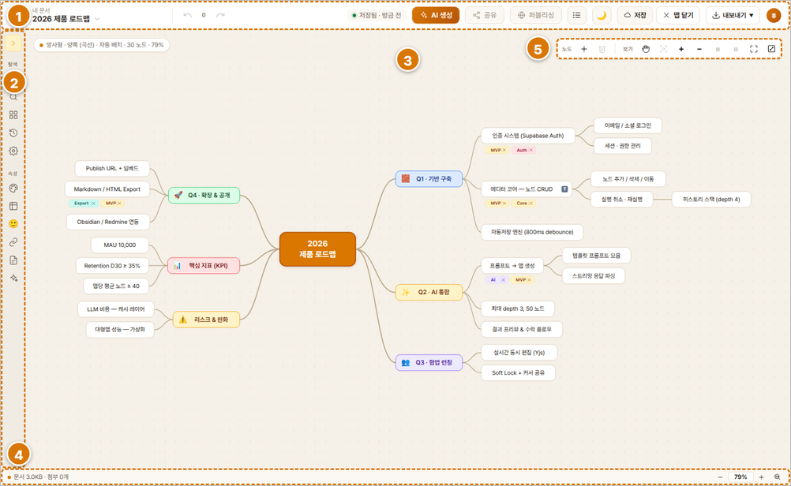

# 01. 시작하기

## 이 프로그램은 무엇인가요?

EasyMindMap은 생각·정보를 **마인드맵(가지 뻗은 그림)** 으로 정리하는
도구입니다. 글로 쓴 문서(Markdown)나 AI 답변을 그대로 맵으로 바꿀 수도
있고, 맵을 웹페이지(HTML)로 내보내 남에게 보여줄 수도 있습니다.

## 화면 구성

`TODO(스크린샷): 전체 화면에 ① 상단 툴바 ② 왼쪽 레일 ③ 가운데 맵 ④ 하단 상태바 번호 표시`

| 위치 | 이름 | 역할 |
|---|---|---|
| 상단 | 툴바 | **편집 화면**: 내 문서·되돌리기/다시 실행·AI 생성·공유·퍼블리싱·아웃라인↔맵 전환·다크모드·**☁ 저장·⧉ 다른 이름으로 저장(서버 맵일 때)·✕ 맵 닫기**·내보내기·계정. **문서함 화면**에서는 로고·내 문서·다크모드·계정만 남고, 맵마다 할 일(공유·퍼블리싱·이름·이동·삭제)은 **행의 관리 칸 아이콘**으로 합니다 (2026-09-07) |
| 왼쪽 | 레일 | **편집 화면**: 검색 / 템플릿 / 히스토리 / 맵 설정, 속성(스타일·레이아웃·아이콘·링크·첨부·노트·태그·AI). **문서함 화면에서는 레일이 없습니다** — 새 맵은 문서함 도구줄의 **＋ 새 맵 ▾** 로 만듭니다 (2026-09-07). Guest 체험에서만 레일에 '새 맵'이 남습니다 |
| 가운데 | 맵 화면 | 노드를 그리고 편집하는 곳 |
| 오른쪽 위 | 맵 도구 | 노드 추가·삭제·보기(펼치기/접기)·화면 맞추기·Pan·전체화면 |
| 하단 | 상태바 | 노드 수·현재 레이아웃·줌 배율 |

## 꼭 알아야 할 용어

- **중심 주제 = 1레벨**: 맵의 한가운데 있는 뿌리 노드입니다. 여기서
  가지가 뻗어 나갑니다.
- **레벨(깊이)**: 중심에서 몇 단계 떨어졌는지. 중심=1레벨, 그 자식=2레벨…
- **노드**: 맵의 낱개 상자 하나.
- **노트**: 노드에 딸린 자세한 설명(문단·코드·표). 노드 옆 작은 배지를
  누르면 열립니다.

## 처음 열었을 때 — 로그인

웹으로 접속하면 **간단한 소개와 로그인 화면**이 먼저 나옵니다. 맵은
내 계정에 저장되기 때문에, 로그인해야 편집을 시작할 수 있습니다.

- 계정이 없으면 이메일과 비밀번호를 넣고 **가입**을 누르세요.
- 비밀번호 칸 오른쪽 **👁**를 누르면 입력한 비밀번호를 확인할 수
  있습니다.
- **카카오·네이버·Google** 로그인은 준비 중입니다(버튼에 '준비 중'
  배지가 붙어 있습니다).
- 가입이 부담스러우면 **👤 Guest로 체험하기 (가입 없이)** 를
  누르세요 — 편집과 MD/HTML 내보내기, 웹 AI는 되지만 **서버 저장·
  문서함·첨부·API 키 AI는 가입 후**에 열립니다.
- 로그인하면 **문서함(내 문서)** 이 열리고 왼쪽 패널은 **`+ 새 맵`**
  메뉴로 시작합니다. 저장해 둔 맵을 고르거나,
  [새 맵 만들기](02-맵-만들기.md)로 시작하면 됩니다.
  (Guest 체험은 곧바로 샘플 맵이 열립니다.)
- 새 맵의 제목은 **"새 맵"**입니다 — 편집을 마치고 **☁ 저장**할 때
  폴더와 이름을 정합니다
  ([08-내보내기-불러오기](08-내보내기-불러오기.md#처음-저장할-때--폴더와-이름을-정합니다)).
- 로그인은 브라우저에 기억되어 새로고침해도 유지됩니다.

> 내 컴퓨터에서 개발용으로 띄운 경우([로컬-실행.md](로컬-실행.md))에는
> 로그인 화면 없이 바로 편집 화면이 열립니다.

## 계정 메뉴 (오른쪽 위 동그란 아이콘)

**이름 첫 글자**(가입 때 적은 성명의 첫 자 — `홍길동`이면 `홍`)가 적힌
동그란 아이콘을 누르면 계정에 관한 것들이 모여 있습니다 — **저장 용량(문서+첨부)
게이지 · 개인 설정 · 비밀번호 변경 · AI 설정 · AI 커넥터(MCP) · 로그인 기록 ·
계정 프로필 · 구독 상태 · 로그아웃**. 아이콘에 마우스를 올리면 이름·이메일·
휴대폰이 풍선으로 보입니다. 성명이 없는 예전 계정은 이메일 첫 글자가 보입니다.
(개인 설정·구독 상태는 **준비 중**이며, 무엇이 들어올지 안내가 나옵니다.)

### 계정 프로필 — 이름 바꾸기 (2026-09-08)

계정 메뉴 ▸ **👤 계정 프로필**에 **이름 · 이메일 · 휴대폰**이 보입니다.
이름과 휴대폰을 고칠 수 있습니다 — 입력하고 **[저장]**(또는 Enter). 저장하면
아바타 글자와 협업맵의 이름표(상단 접속자 · 노드 위 커서)가 곧바로 새
이름을 씁니다. 이메일은 로그인 계정이라 바꿀 수 없습니다.

- 가입 때 적은 성명·휴대폰이 **비어 있는 계정**이 있습니다 — 메일 확인이
  켜진 서버에서는 가입 직후 로그인 세션이 없어 프로필이 저장되지 못했습니다
  (2026-09-08 고침: 이제 가입 때 적은 것을 브라우저에 두었다가 처음 로그인할
  때 저장합니다). 그 전에 가입한 계정은 여기서 한 번 넣어 주세요.
- 서버에서 프로필을 **읽지 못하면** "등록되지 않음"이 아니라 ⚠ 안내와
  이유가 창 위에 보입니다. 그 문구를 알려 주시면 원인을 찾을 수 있습니다.
- **성명 규칙** (2026-09-08): 가입할 때도, 여기서 고칠 때도 **한글 또는
  영문(대소문자) 2자 이상**이어야 합니다. 글자 사이 공백은 되고 숫자·기호는
  안 됩니다. 서버도 같은 규칙으로 거릅니다.
- **사진·아바타** (2026-09-08): 창 맨 위에서 **[사진 선택]**으로 사진을
  넣거나 이모지 아바타 하나를 고릅니다(네이버 웨일 프로필처럼). 사진은
  96×96 으로 줄여 저장되고, [기본으로]를 누르면 다시 이름 첫 자가 됩니다.
  우상단 아바타에 곧바로 반영됩니다. 서버가 아직 사진 열을 갖추지 못했으면
  창에 ⚠ 안내가 뜨고 사진 선택만 막힙니다(관리자가 델타 SQL 적용).
- **회원탈퇴**는 계정 메뉴가 아니라 **이 창 맨 아래**의 "⚠ 회원탈퇴…"에
  있습니다 (2026-09-08 — 로그아웃 바로 밑에 있어 잘못 누를 수 있었습니다).
  누르면 예전처럼 확인 창에서 `회원탈퇴`를 직접 입력해야 진행됩니다.
- 계정 관련 팝업(계정 프로필·비밀번호 변경·AI 설정·AI 커넥터·로그인
  기록·회원탈퇴)은 오른쪽 위 **×** 로도 닫을 수 있습니다. AI 설정처럼 긴
  창은 본문만 스크롤되고 **제목과 × 는 제자리에** 있습니다.

### 로그아웃하면 이 브라우저에 남은 임시 보관도 지워집니다

편집 중인 내용은 서버에 저장되기 전이라도 **이 브라우저 안에** 임시로
보관됩니다(갑자기 꺼져도 되살릴 수 있도록 —
[10-자주-묻는-질문](10-자주-묻는-질문.md)). 이 임시 보관은 계정이 아니라
**브라우저**에 붙어 있습니다.

그래서 **로그아웃하면 함께 지웁니다.** 지우지 않으면 회사·학교처럼
여럿이 쓰는 컴퓨터에서 다음 사람이 로그인했을 때 *"저장되지 않은 맵이
있습니다"* 로 **앞사람 문서가 뜹니다.**

> ⚠️ 아직 서버에 저장하지 않은 내용이 있으면 로그아웃 전에 **먼저
> 물어봅니다** — "저장되지 않은 편집이 N개 있습니다". 여기서
> **[취소 — 먼저 저장하기]** 를 누르고 ☁ 저장을 하면 안전합니다.
> **[그대로 로그아웃]** 을 고르면 그 내용은 **되돌릴 수 없습니다.**
>
> 저장할 것이 없으면 묻지 않고 바로 로그아웃합니다.

## 다크 모드

상단 툴바의 **달/해 아이콘**을 누르면 어두운 화면으로 바뀝니다. 다시
누르면 밝은 화면으로 돌아옵니다. 설정은 새로고침해도 유지됩니다.

> **직접 색을 지정한 노드는 모드를 바꿔도 그대로**입니다 — 채움색이나
> 글자색을 지정한 노드(강조용)는 라이트/다크 전환에 글자색이 따라
> 바뀌지 않습니다. 글자색 없이 채움색만 지정했다면 채움의 밝기에 맞는
> 읽기 좋은 고정색(밝은 배경=진한 글자, 어두운 배경=밝은 글자)이
> 쓰입니다. 내보낸 HTML 뷰어의 다크 모드도 동일합니다.

`TODO(스크린샷): 다크 모드 토글 위치`
