# 03. 노드 편집

## 노드 추가

노드를 하나 선택한 뒤:

| 방법 | 결과 |
|---|---|
| 노드를 **선택하면** 사방에 나오는 **`+` 버튼** | 그 방향으로 노드 추가. `+` 에 마우스를 올리면 무엇이 생기는지 문구가 뜹니다 (아래 **레이아웃별 방향**) |
| `Space` | 자식 노드 추가 |
| `Shift+Space` | 아래 형제 노드 추가 |
| `Enter` | 아래 형제 노드 추가 |
| `Tab` (편집 끝낸 뒤) | 자식 노드 추가 |
| `Ctrl+Space` | 여러 노드 한 번에 추가 — **들여쓴 줄은 하위 노드** (아래 참조) |
| `Ctrl+←` | 상위(부모) 노드 추가 |
| 오른쪽 위 도구의 **노드 `+`** | **고른 노드가 있으면** 메뉴 — `자식 노드 추가` / `달력 노드 추가…` (아래 절). **고른 것이 없으면** 빈 캔버스에 **중심 노드**를 하나 더 만듭니다 (2026-09-22) |

### `+` 버튼의 방향은 레이아웃을 따릅니다

노드를 선택하면 `+` 가 최대 네 개 뜹니다. 각 `+` 에 마우스를 올리면
**상위 노드 추가 · 하위 노드 추가 · 형제 노드 앞에 추가 · 형제 노드 뒤에
추가** 중 하나가 문구로 뜹니다. 어느 방향이 어느 것인지는 **그 레이아웃에서
하위 노드가 자라는 방향**을 따릅니다 — 하위가 오른쪽으로 자라면 오른쪽 `+`
가 하위이고, 아래로 자라면 아래 `+` 가 하위입니다. 중심 주제는 **하위
추가만** 있습니다(방사형 · 양쪽이면 좌·우 두 개).

| 레이아웃 | 하위 | 상위 | 형제 앞 | 형제 뒤 |
|---|---|---|---|---|
| 방사형 · 양쪽(오른쪽 가지) · 방사형 · 오른쪽 · 트리 · 오른쪽 · 계층형 · 오른쪽 · 자유 배치 | → | ← | ↑ | ↓ |
| 방사형 · 양쪽(왼쪽 가지) | ← | → | ↑ | ↓ |
| 트리 · 아래 · 진행트리 · 오른쪽 | ↓ | ↑ | ← | → |
| 시간배치 2종 — **축 위** 노드 | 축 바깥쪽 | 축 쪽 | ← | → |
| 시간배치 2종 — 축에서 뻗은 **하위** | → | ← | 축 쪽 | 축 바깥쪽 |
| Kanban 보드 | `+` 버튼 없음 — `Space`·`Enter` 단축키로 추가 | | | |

> 아래 그림의 검은 라벨은 각 `+` 의 문구를 **설명하려고 한꺼번에 그려
> 넣은 것**입니다. 실제 화면에서는 마우스를 올린 `+` 하나에만 뜹니다.

<table>
<tr><td align="center" valign="top">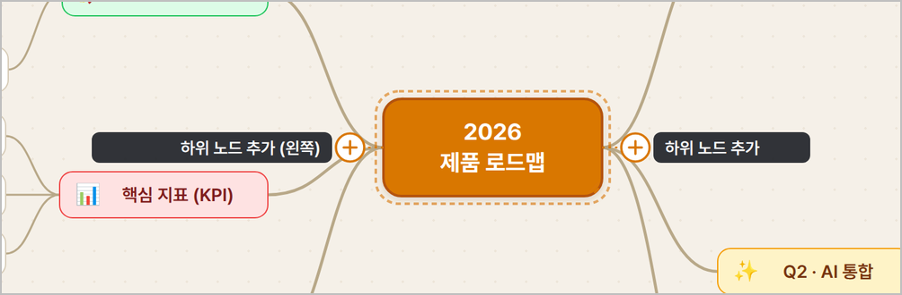<br><sub>방사형 · 양쪽 — 중심 주제 (하위 추가만, 좌·우)</sub></td><td align="center" valign="top">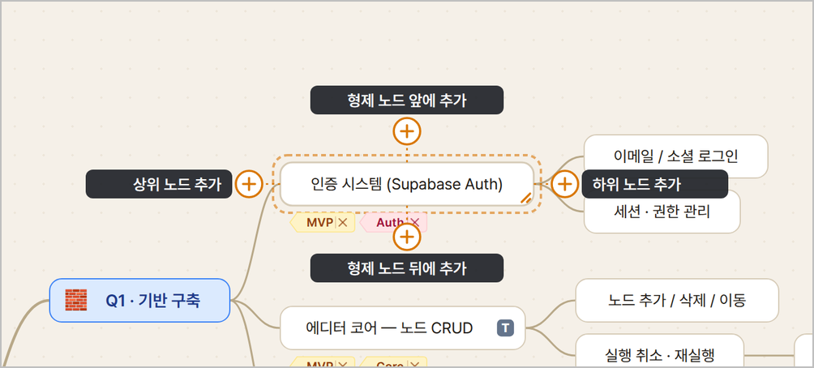<br><sub>방사형 · 양쪽 — 오른쪽 가지</sub></td></tr>
<tr><td align="center" valign="top">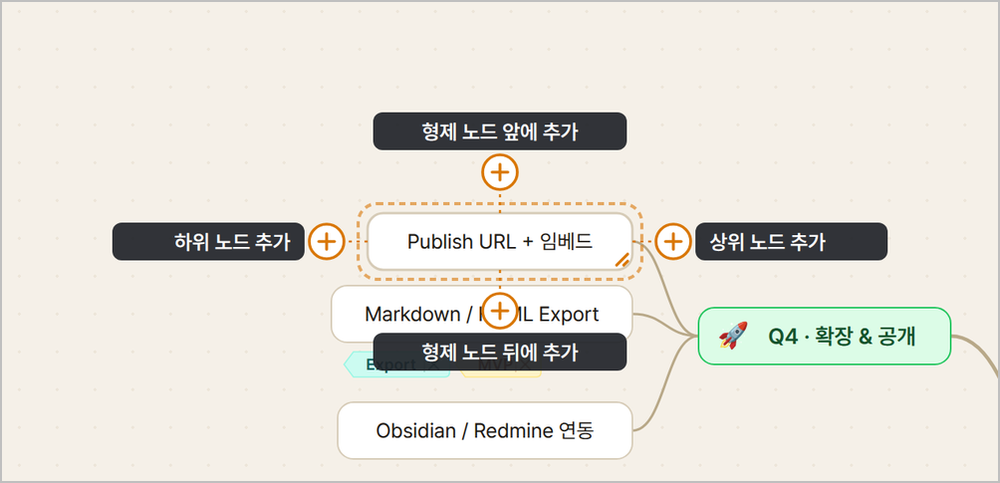<br><sub>방사형 · 양쪽 — 왼쪽 가지 (하위가 왼쪽)</sub></td><td align="center" valign="top"><br><sub>방사형 · 오른쪽</sub></td></tr>
<tr><td align="center" valign="top">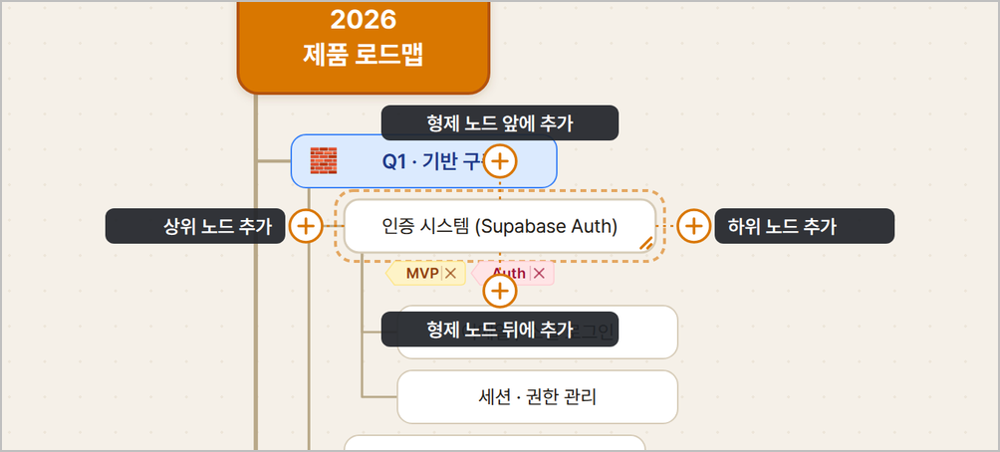<br><sub>트리 · 오른쪽</sub></td><td align="center" valign="top">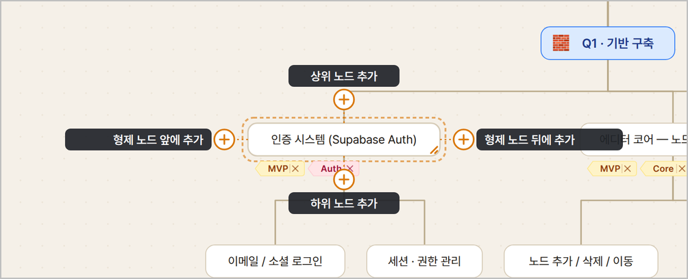<br><sub>트리 · 아래 (하위가 아래, 형제가 좌우)</sub></td></tr>
<tr><td align="center" valign="top">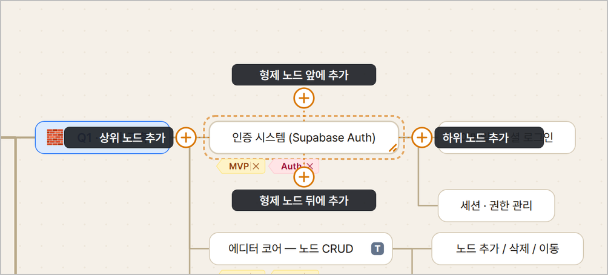<br><sub>계층형 · 오른쪽</sub></td><td align="center" valign="top">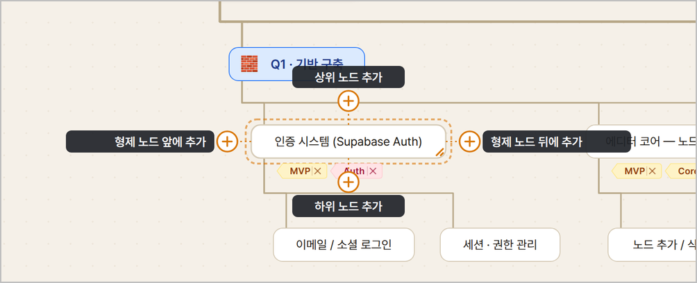<br><sub>진행트리 · 오른쪽 (하위가 아래, 형제가 좌우)</sub></td></tr>
<tr><td align="center" valign="top">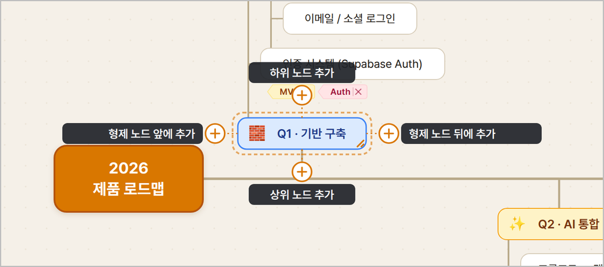<br><sub>시간배치 (타임라인) — 축 위 노드</sub></td><td align="center" valign="top">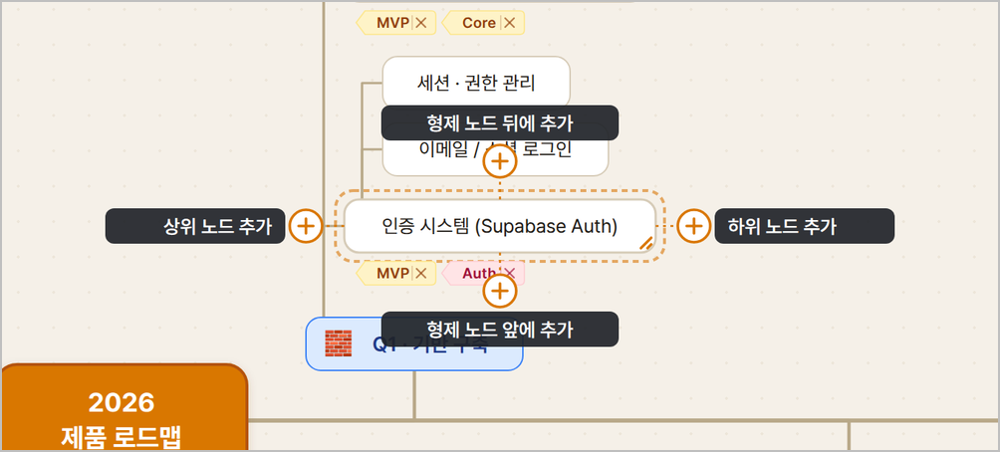<br><sub>시간배치 (타임라인) — 축에서 뻗은 하위</sub></td></tr>
<tr><td align="center" valign="top">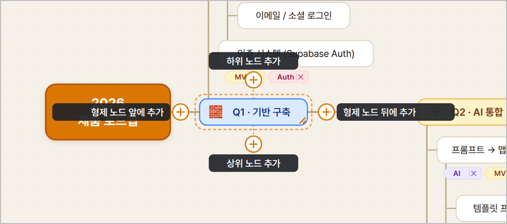<br><sub>시간배치 (중앙노드) — 축 위 노드</sub></td><td align="center" valign="top">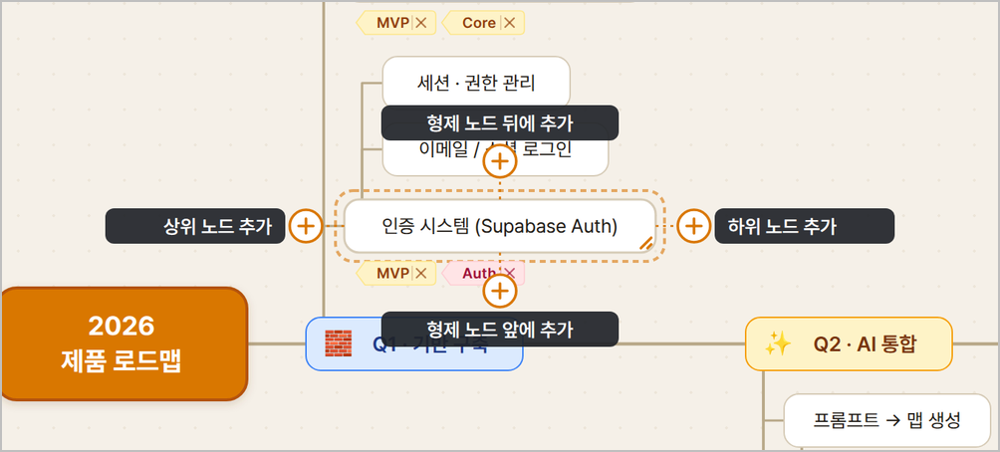<br><sub>시간배치 (중앙노드) — 축에서 뻗은 하위</sub></td></tr>
</table>


### 여러 노드 한 번에 추가 (`Ctrl+Space`) — 들여쓰기가 계층입니다

노드를 고르고 `Ctrl+Space` 를 누르면 **다중 노드 추가** 창이 뜹니다. 한 줄에
하나씩 적으면 각 줄이 그 노드의 자식이 되고, **스페이스나 Tab 으로 들여쓴
줄은 바로 위 덜 들여쓴 줄의 하위 노드**가 됩니다(2026-09-08). `Ctrl+Enter`
로 추가합니다.

```
- I. 문제정의
  - 10. 연 128억 건 발급, 60%는 즉시 폐기 (1P)
  - 11. 국가 데이터 공백 (2P)
- II. 해결구조
  - 20. 간편인증 한 번으로 영수증 통합 (5P)
```

→ `I. 문제정의` 아래에 `10.`·`11.`, `II. 해결구조` 아래에 `20.` 이 들어갑니다.

- 들여쓰기 폭은 **상대적**입니다. 2칸·4칸·Tab 어느 것이든 "위 줄보다 더 들여썼는가"
  만 봅니다. 마크다운 목록이나 AI 답변의 목차를 그대로 붙여 넣으면 됩니다.
- 줄 앞의 `-` `*` `•` 불릿은 떼고, **번호(`10.` `I.`)는 그대로** 남깁니다.
- 창 안에서 `Tab` 은 두 칸 들여쓰기, `Shift+Tab` 은 내어쓰기입니다(포커스가
  빠져나가지 않습니다).
- 아래 "N개 노드" 숫자가 하위 노드까지 센 전체 개수입니다.

## 달력 노드 추가 (오른쪽 위 `+` ▸ 달력 노드 추가…) — 년도 → 월, 년월 → 주

노드 하나를 고르고 오른쪽 위 도구의 **`+`** 를 누르면 메뉴가 뜹니다.

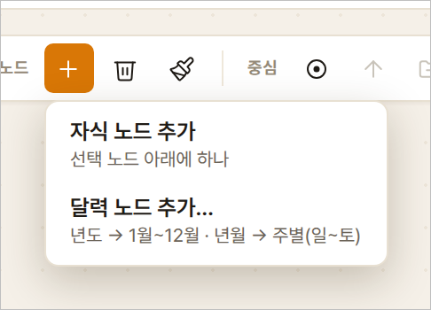

**`달력 노드 추가…`** 를 고르면 작은 창이 뜨는데, 고른 노드의 글(과 상위
노드)에서 읽은 **년도·월이 미리 채워져** 있습니다. 확인만 하거나 고치세요.

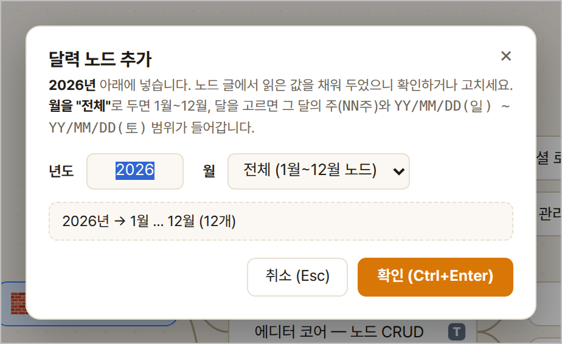

| 노드 글 (예) | 읽는 값 | 확인하면 아래에 생기는 것 |
|---|---|---|
| `2026년` · `26년` · `2026` · `26` · `2026년 계획` | 년도 | **1월 … 12월** 12개 |
| `2026년 9월` · `2026년09월` · `26년9월` · `2026/09` · `26/09` · `2026.9` | 년도 + 월 | 그 달에 걸친 **주마다 `[36주] 2026/08/30(일) ~ 09/05(토)`** 노드, 그 아래 **날짜 노드 7개** `2026/08/30(일)` … `2026/09/05(토)`. 일요일·토요일·공휴일은 **빨간 글자**, 공휴일은 줄을 바꿔 `[추석]`, 그 달이 아닌 날(앞뒤 달)은 **회색 점선** |
| `9월` (상위 노드에 `2026년`) | 월 + 상위의 년도 | 위와 같음 — `2026년` → `9월` 을 고르고 누르면 됩니다 |
| 아무 정보 없음 | — | 창에 **올해**가 채워집니다. 년도·월을 직접 고르세요 |

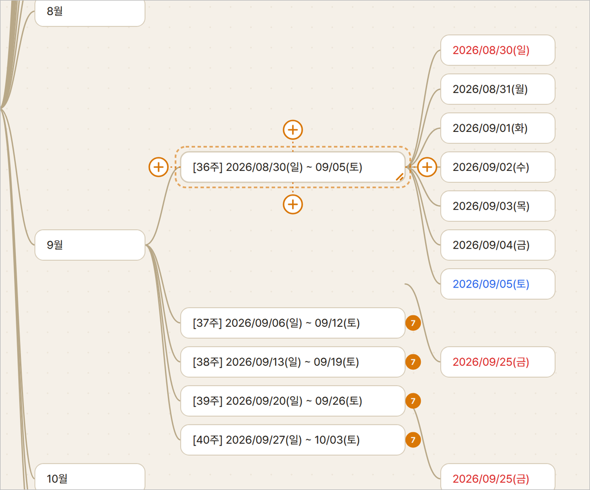

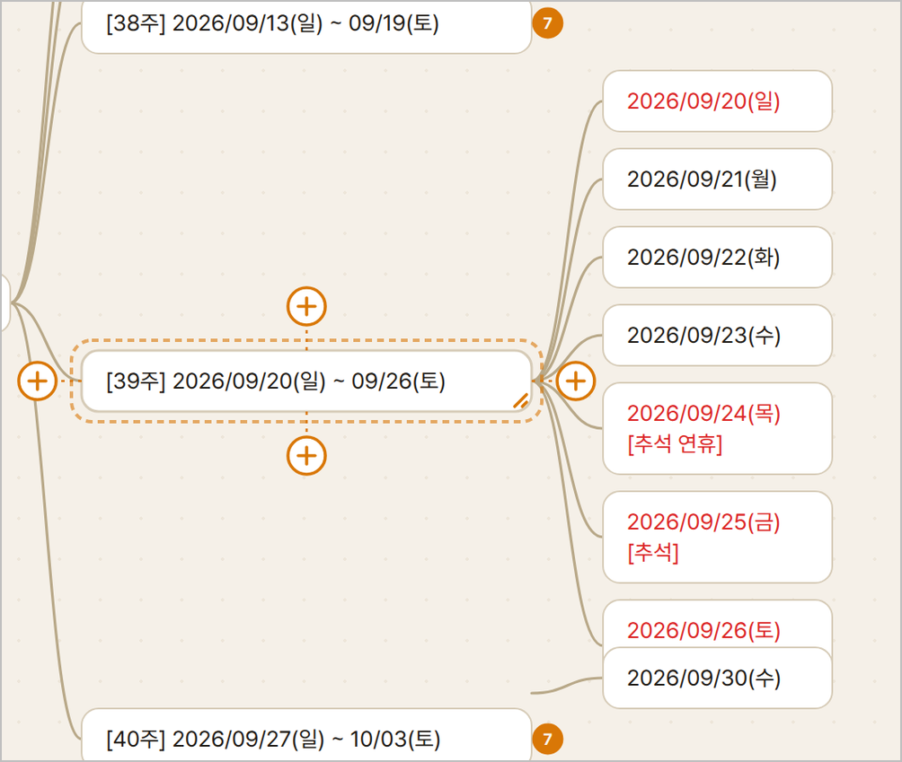

- 주 번호는 **1월 1일이 든 주가 1주**(일요일 시작)입니다. 1월 첫 주가 전년
  12월에서 시작해도 `[01주]`, 12월 마지막 주가 다음 해로 넘어가도 `[53주]` 로
  이 해 번호를 씁니다. 해가 바뀌는 주는 끝 날짜에도 년도를 붙입니다
  (`[53주] 2026/12/27(일) ~ 2027/01/02(토)`).
- **빨간 날** — 일요일·토요일과 공휴일(설·추석·부처님오신날·대체공휴일·
  선거일 포함, 2024~2030년)은 날짜 글자가 빨강입니다. 공휴일은 날짜 아래
  줄을 바꿔 `[추석]`·`[한글날]` 처럼 이름이 붙습니다. 2024~2030년 밖의 해는
  날짜가 정해진 공휴일(신정·삼일절·어린이날·현충일·광복절·개천절·한글날·
  크리스마스)만 알고, 창에 그렇다는 안내가 뜹니다.
- **앞뒤 달의 날은 희미하게** — 9월을 골랐을 때 36주의 08/30·08/31, 40주의
  10/01~10/03 처럼 그 달이 아닌 날은 **회색 글자 + 점선 테두리**입니다
  (공휴일이어도 희미하게, 이름은 붙습니다). 글자색·테두리는 보통 스타일이라
  스타일 탭에서 바꾸거나 지울 수 있습니다.
- 한 번에 들어간 노드는 `Ctrl+Z` 한 번으로 전부 되돌아갑니다.

### 표로 붙여넣기 — 노드를 만들지 않고 노드 내용에 달력 표

창에서 달을 고르면 **`표로 붙여넣기`** 체크가 켜집니다. 체크하고 확인하면
자식 노드를 만들지 않고, **고른 노드의 내용 끝에** 그 달의 달력 표(일~토
7열, 주마다 한 행)가 붙습니다. 일요일·공휴일 날짜는 **굵게**만 표시합니다
(이름은 넣지 않습니다 — 칸이 넓어져 표가 깨져 보이기 때문입니다).

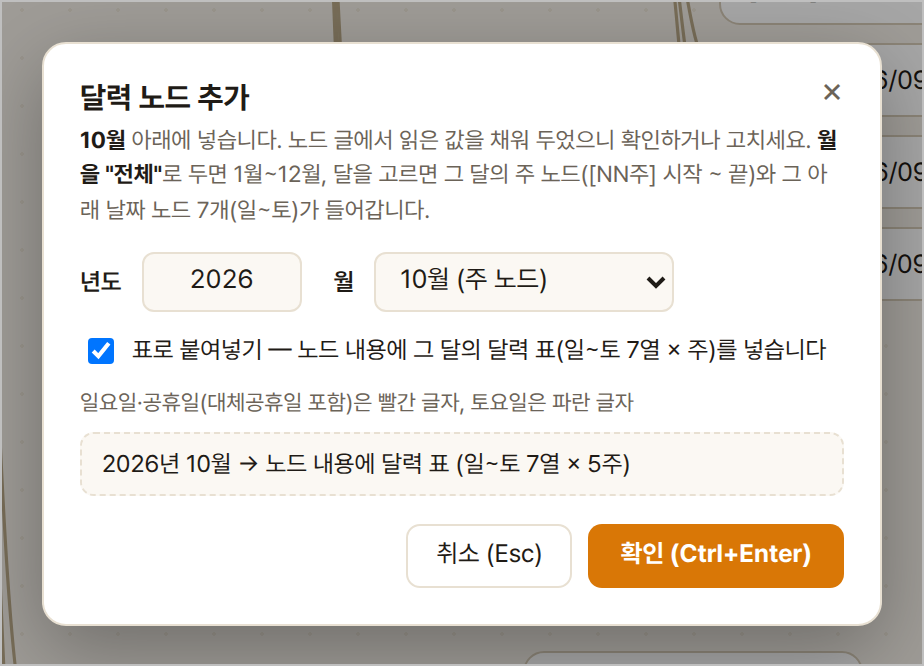

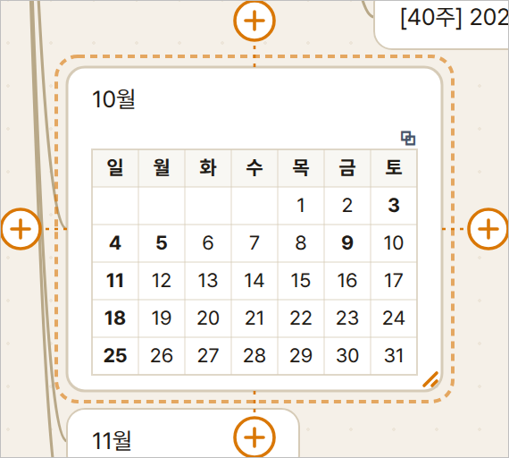

- 월을 **전체**로 두면 표로 넣을 수 없어 체크가 꺼집니다 (12개월 표를 한
  노드에 넣지는 않습니다).
- 붙인 표는 보통 노드 표와 같습니다 — 더블클릭하면 표 편집 창이 열리고,
  `Ctrl+Z` 한 번으로 붙이기 전 내용으로 돌아갑니다. 같은 노드에 두 달을
  이어 붙여도 표가 **둘 다** 그려집니다 (아래 "표" 절).
- 노드에 이미 자식이 있으면 그 **뒤에** 붙습니다.

## 글자 편집

- 노드를 **더블클릭**하면 글자를 고칠 수 있습니다 (아웃라인 화면에서는
  `Enter`·`F2`도 됩니다).
- 편집 중 `Enter` = 저장하고 편집 끝내기, `Shift+Enter` = 줄바꿈,
  `Esc` = 편집 취소(고친 내용 버림). 코드 펜스(```)를 연 상태에서는
  `Enter`가 줄바꿈으로 동작합니다.
- 여러 줄로 길게 써도 됩니다.

## 노드 삭제

노드를 선택하고 `Delete`, 또는 오른쪽 위 도구의 **휴지통** 아이콘.
하위 노드까지 함께 지워집니다.

## 노드 복사·붙여넣기

노드를 고르고 `Ctrl+C`(여러 개는 빈 곳 드래그로 다중 선택), 붙일
위치의 노드를 고르고 `Ctrl+V` 하면 **그 노드의 하위**로 통째(하위
포함) 복사됩니다. 여러 개를 복사했으면 **전부** 그 노드의 하위로
순서대로 붙습니다. `Ctrl+X` 는 잘라내기입니다. Kanban 보드에서도
같습니다. (마우스로 끌어서 옮기는 것은 아래 "노드 이동 (드래그)" —
여러 노드도 한꺼번에 갑니다.)

**다른 맵·다른 창에도 붙습니다** — 맵 A 에서 `Ctrl+C`, 맵 B 탭에서
`Ctrl+V` 하면 하위 노드까지 그대로 옮겨집니다. 노드 색·노트·사진도
함께 갑니다 (문단 노트에 붙여넣은 기사의 사진도 갑니다). 다만 **첨부파일은 따라가지 않습니다** (원래 맵의 저장소에
묶여 있어 다른 맵에서 열리지 않습니다).

> **다른 마인드맵 앱(ThinkWise 등)의 그림은 복사되지 않습니다.**
> 그 앱들이 클립보드에 표준 이미지를 넣지 않고 자기 형식만 넣기
> 때문입니다 — 브라우저는 그 형식을 읽을 수 없습니다. 그림을 옮기려면
> 그 앱에서 **이미지 파일로 저장**하거나 **화면을 캡처**해서
> 붙여넣으세요. (글자는 그대로 복사·붙여넣기가 됩니다.)

## 노드 이동 (드래그)

노드를 끌어서 다른 노드의 위/아래/자식 위치로 옮길 수 있습니다.
방사형·양쪽 레이아웃에서는 반대쪽 빈 공간으로 끌면 그쪽 가지로
바뀝니다 (끌 때 "왼쪽으로 이동" 같은 안내 배지가 나옵니다).

끌어다 놓는 자리는 네 가지입니다. 놓기 전에 초록 표시로 어디에 붙을지
보여 줍니다 — **하위**는 노드 전체가 초록 테두리로 감싸이고, **상위·앞·뒤**는
그 변에 얇은 초록 바가 붙습니다.

| 놓는 자리 | 결과 |
|---|---|
| 노드 **안쪽** | 그 노드의 **하위**로 (맨 뒤에) — 어느 레이아웃에서든 같습니다 |
| 자식이 놓이는 쪽 바깥 | **하위** |
| 그 반대쪽(부모가 있는 쪽) 바깥 | 끈 노드가 그 노드의 **상위(부모)** 가 됩니다 — 대상이 끈 노드 아래로 들어갑니다 |
| 형제가 늘어선 방향의 앞/뒤 바깥 | 그 노드의 **앞/뒤 형제**로 |

네 방향은 레이아웃 이름이 아니라 **지금 화면에 실제로 놓인 자리**로
정합니다 (2026-09-08). 형제가 어느 축으로 늘어섰는지, 자식이 어느 쪽에
있는지, 부모가 어느 쪽에 있는지를 보고 정하므로, 한 맵 안에 레이아웃이
섞여 있어도(예: 트리·오른쪽 맵의 한 줄만 진행트리) 그 노드가 보이는
그대로 붙습니다. 레이아웃별로 정리하면 이렇습니다.

| 레이아웃 | 상위 | 하위 | 앞 형제 | 뒤 형제 |
|---|---|---|---|---|
| 방사형(오른쪽 가지) · 계층형 | 왼쪽 | 오른쪽 | 위 | 아래 |
| 방사형·양쪽의 **왼쪽 가지** | 오른쪽 | 왼쪽 | 위 | 아래 |
| 트리 아래 · 진행트리(형제가 가로로 늘어선 줄) | 위 | 아래 | 왼쪽 | 오른쪽 |
| 트리 오른쪽(개요형 — 자식이 아래에 들여쓰기) | 왼쪽 | 오른쪽 | 위 | 아래 |
| 시간배치 — 축 위의 노드 | 축 반대쪽 | 축 쪽(자식이 쌓이는 쪽) | 왼쪽 | 오른쪽 |
| 시간배치 — 축 아래/위 스택의 항목 | 왼쪽 | 오른쪽 | 축 쪽 | 축 반대쪽 |

> 개요형(트리 오른쪽)처럼 자식과 형제가 **모두 아래**에 놓이는 곳에서는
> 위/아래가 형제, 왼쪽/오른쪽이 상위/하위입니다 — 개요 편집기에서
> 들여쓰기(오른쪽)가 하위인 것과 같습니다.
>
> 형제 사이 틈이 좁으면(방사형은 10px 남짓) 그 틈에 놓았을 때 위 노드의
> "뒤"와 아래 노드의 "앞"이 같은 자리이므로 어느 쪽으로 판정돼도 결과는
> 같습니다.

### 여러 노드를 한꺼번에 옮기기 (2026-09-08)

빈 곳을 드래그해 **여러 노드를 고른 뒤** 그중 하나를 끌면 **고른 노드
전부**가 함께 갑니다. 끌 때 "3개 이동" 같은 배지가 붙습니다.

| 놓는 자리 | 결과 |
|---|---|
| 하위 | 고른 노드 전부가 그 노드의 하위로, **원래 순서(위→아래)대로** 붙습니다 |
| 앞/뒤 형제 | 전부가 그 자리에 순서대로 끼어듭니다 |
| **상위(부모)** | **안 됩니다** — 상위로 붙이기는 **한 개의 노드만** 가능합니다. 끌고 가면 바 색이 주황으로 바뀌고 "상위로 붙이기는 1개만 가능" 이 뜨며, 놓으면 안내 메시지만 나오고 아무것도 옮겨지지 않습니다. 노드 하나만 고른 뒤 다시 끌어 주세요 |

- 고른 노드의 **하위 노드는 따라갑니다** — 부모와 그 자손을 함께 골라도
  부모만 옮기면 되므로 한 번에 갑니다.
- 되돌리기(`Ctrl+Z`)는 **한 단계**로 전부 돌아옵니다.
- 하나라도 못 옮기는 자리(깊이 한도 50단계 초과 등)면 **아무것도 옮기지
  않고** 안내합니다 — 몇 개만 옮겨진 채 남지 않습니다.
- 옮긴 뒤에도 다중 선택은 그대로라 이어서 크기·스타일을 같이 손볼 수
  있습니다.
- 방사형·양쪽에서 반대쪽 빈 곳에 놓으면 고른 노드 전부가 그쪽으로
  갑니다.

<table>
<tr><td align="center" valign="top">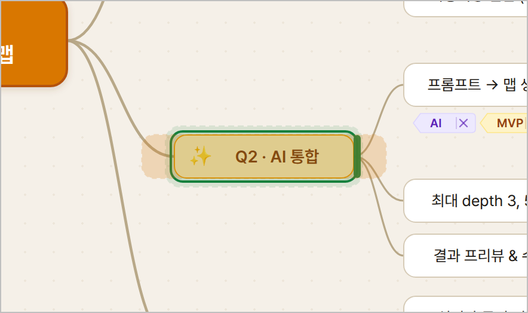<br><sub>노드 <b>안쪽</b>에 놓기 → 하위 (초록 테두리)</sub></td>
<td align="center" valign="top">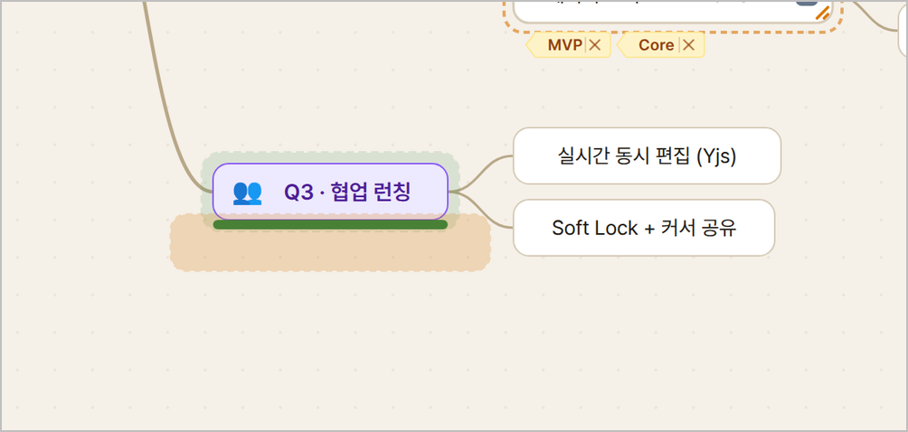<br><sub>형제 방향 바깥에 놓기 → 앞/뒤 형제 (초록 바)</sub></td></tr>
<tr><td align="center" valign="top">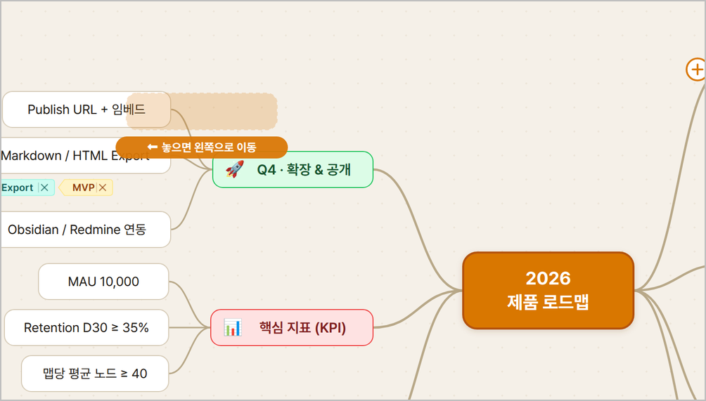<br><sub>방사형 · 양쪽 — 반대쪽 빈 곳으로 끌면 좌/우 이동 배지</sub></td>
<td align="center" valign="top">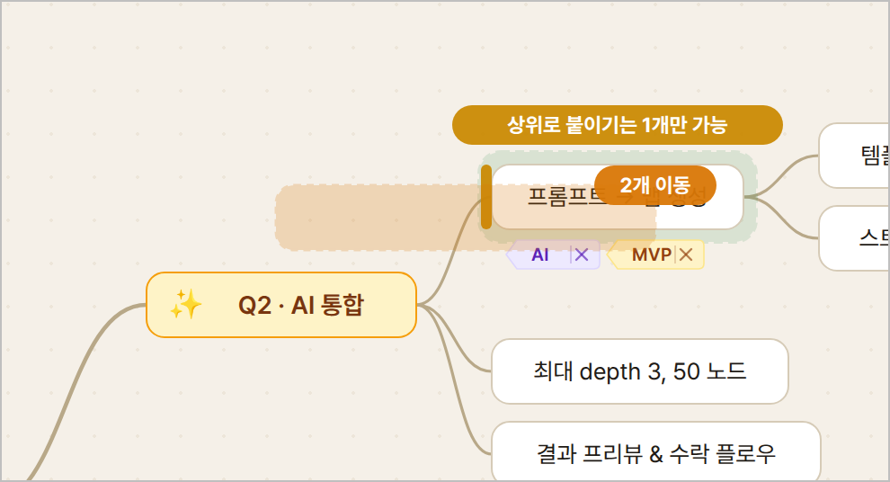<br><sub>여러 노드 드래그 — "N개 이동" 배지, 상위 자리는 주황으로 막힘</sub></td></tr>
</table>


## 노드 크기 조절 (우하단 모서리)

노드를 고르면 오른쪽 아래 모서리에 작은 **꺾쇠 핸들**이 나타납니다.

| 조작 | 결과 |
|---|---|
| 핸들을 **끌기** | 그 노드의 폭·높이가 바뀝니다(폭 90~900, 높이 36~1200) |
| 핸들을 **더블클릭** | 자동 크기로 돌아갑니다 |
| 빈 곳을 드래그해 **여러 노드를 고른 뒤** 그중 하나의 핸들을 끌기 | **고른 노드 전부가 같은 크기**가 됩니다 (2026-09-08). 더블클릭도 전부 자동 크기로 |

여러 노드를 같은 크기로 맞출 때 쓰세요. 예를 들어 사진 노드 네 개를 드래그로
고르고 하나의 모서리를 끌면 넷이 똑같은 폭·높이가 됩니다. 되돌리기(`Ctrl+Z`)는
한 번에 전부 되돌립니다.

## 스타일 복사 (🖌 붓) — 한 노드의 모양을 다른 노드에

한 노드에 맞춰 둔 **도형·채움색·테두리·글자색·굵게·글자맞춤**을 다른 노드에도
똑같이 입히고 싶을 때 씁니다. 글·노트·아이콘 같은 **내용은 건드리지 않습니다.**

1. 모양이 마음에 드는 노드를 **하나** 고릅니다.
2. 캔버스 오른쪽 위 툴바의 **붓 버튼**을 누릅니다.

   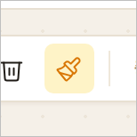

3. 마우스 커서 오른쪽 아래에 **"🖌 스타일 복사"** 붓이 따라다닙니다.
   이 상태에서 **다른 노드를 클릭**하면 그 노드가 같은 모양이 됩니다.

   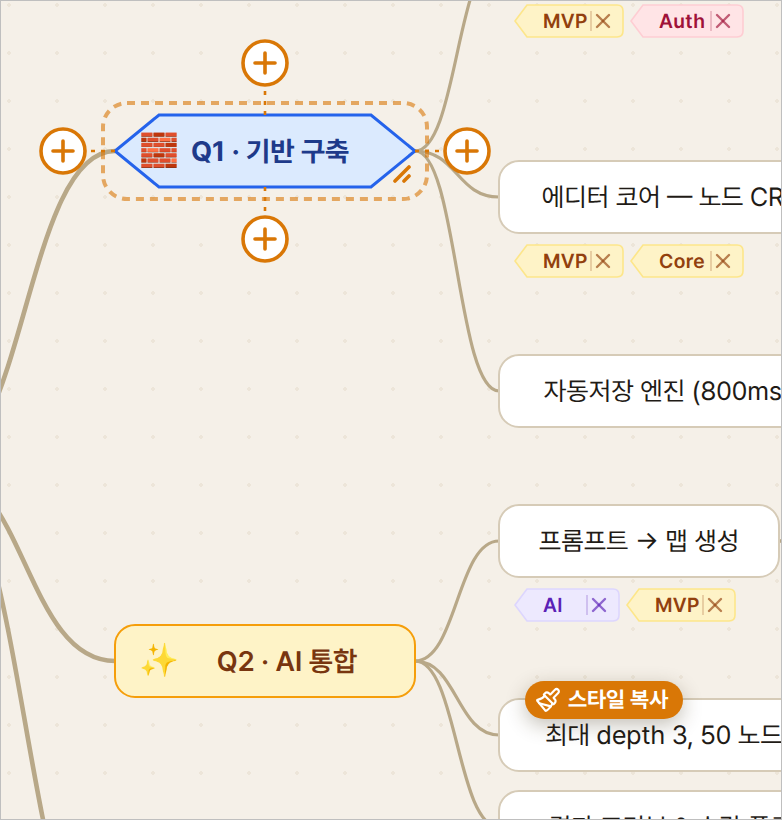

4. 하나씩 눌러도 되고, 빈 곳을 **드래그해 여러 노드를 한꺼번에** 고르면
   걸린 노드 전부가 한 번에 바뀝니다. 붓은 계속 켜져 있어 이어서 칠할 수
   있습니다.

   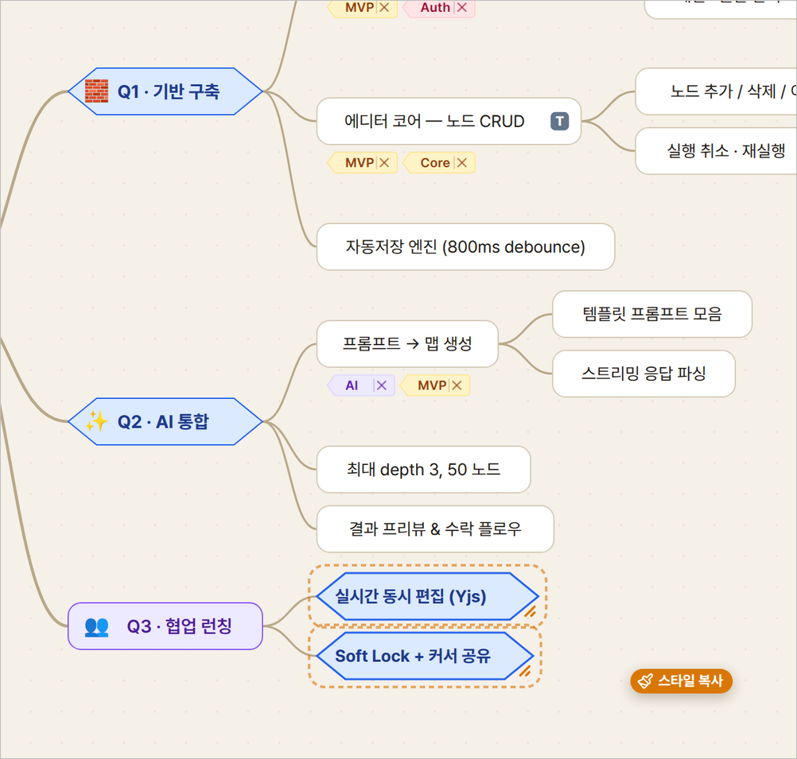

5. 다 했으면 **`Esc`** 를 누르거나 **빈 곳을 클릭**하면(또는 붓 버튼을 다시
   누르면) 붓이 사라집니다.

| 알아 둘 것 | |
|---|---|
| 되돌리기 | `Ctrl+Z` 한 번 = 클릭 한 번(또는 드래그 한 번)에 칠한 것 전부 |
| 글자 크기 | 옮기지 않습니다 — 글자 크기는 레벨(1레벨·2레벨…)이 정합니다 |
| 노드 크기·아이콘·태그 | 옮기지 않습니다 (크기는 우하단 핸들, 아이콘은 아이콘 탭) |
| 붓에 담긴 것 | 버튼을 누른 순간의 모양입니다. 기본 모양 노드에서 뜨면 **칠한 노드가 기본 모양으로 돌아갑니다**(스타일 지우개) |
| 중심주제 | 중심주제에도 칠할 수 있지만 가지 색 계열은 바뀌지 않습니다 |
| 흰 노드 | 색을 따로 정하지 않은 흰 노드(2레벨 이하 기본 모양)에서 붓을 뜨면, 색이 있는 가지에 칠해도 **흰 바탕**이 됩니다 |

## 부분 강조 (굵게·형광펜·코드)

글자 편집 중 일부를 선택하면 위에 작은 툴바(**B** 굵게 / *I* 기울임 /
~~S~~ 취소선 / U 밑줄 / H 형광펜 / `{ }` 코드 블록 / ☑ 체크 / ⊞ 표)가
뜹니다. 버튼을 누르면 그 구간만 강조됩니다. 단축키 `Ctrl+B` / `Ctrl+I` / `Ctrl+U`도 됩니다.

> **편집 중에도 바로 보입니다** — 강조를 넣는 순간(또는 `**`·`==`·
> 백틱을 직접 타이핑하는 순간) 편집 창 안에서 마커는 흐리게, 형광펜은
> 노란 띠로, 코드는 회색 띠로 **즉시 미리보기**됩니다. 저장(Enter)
> 전에 적용 여부를 확인할 수 있고, 커서 위치는 그대로 정확합니다.

## 코드 블록 (`{ }`)

- 툴바의 **`{ }` 버튼을 누르면 팝업 창**이 뜹니다 — **언어와 코드를
  팝업에서 입력**하고 확인을 누르면 노드에 코드 **패널**(언어 라벨 +
  ⧉ 복사 버튼)로 들어갑니다. 작은 노드 안에서 여러 줄 코드를 직접
  칠 필요가 없습니다.
- **수정**: 이미 만든 코드 패널을 **더블클릭**하거나 **언어 라벨(✎)을
  클릭**하면 같은 팝업이 언어·코드가 채워진 채 열립니다. 언어만 바꿔도
  되고 코드를 고쳐도 됩니다 (언어를 비우면 `code`로 표시).
  **아웃라인·칸반의 코드 패널에서도 언어 라벨(✎)을 클릭**하면 같은
  팝업이 열립니다 — 맵으로 돌아갈 필요가 없습니다.
- **직접 타이핑도 가능**: 편집 중 ```` ```bash ````처럼 여는 펜스를 치면
  그때부터 **Enter가 줄바꿈**으로 동작하고, 닫는 ``` 뒤 Enter로 편집이
  끝납니다.
- **글 순서는 그대로**: 코드 블록 위에 쓴 글은 패널 위에, 아래에 쓴 글은
  패널 아래에 표시됩니다 (`Shift+Enter`로 블록 뒤에 이어 쓸 수 있습니다).
- 문장 속 **한 구간만 코드**로 표시하려면 백틱(`` ` ``)으로 감싸면
  됩니다 — `` `npm install` `` 처럼 (고정폭 + 회색 배경).

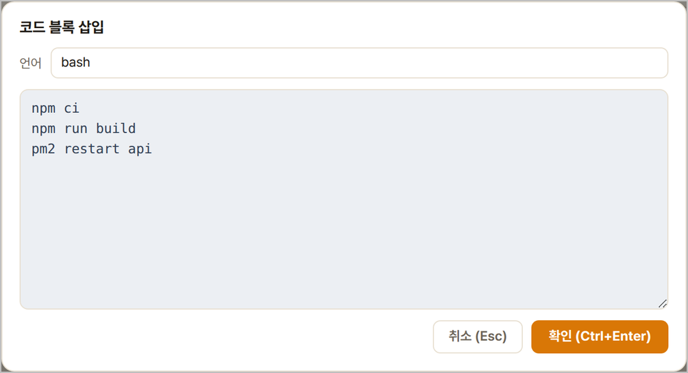

> `{ }` 를 누르면 뜨는 팝업입니다. 언어는 비워도 됩니다. **확인(Ctrl+Enter)** 을
> 누르면 편집 중이던 글의 커서 자리에 코드 블록이 들어가고, 편집은 계속됩니다.

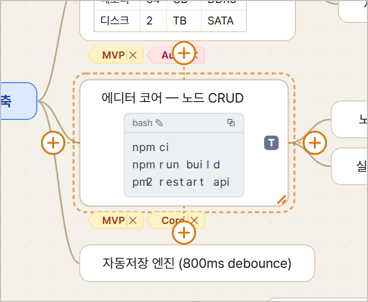

## 체크박스 (☑)

- 편집 중 툴바의 **☑ 버튼**을 누르면 커서가 있는 줄이 체크 항목
  (`- [ ] `)이 됩니다 (다시 누르면 해제). 직접 `- [ ] 할 일`처럼
  타이핑해도 같습니다 (`- [x]` = 완료).
- 편집을 마치면 마커 대신 **체크박스**가 그려집니다 — **클릭하면
  완료↔미완료가 토글**됩니다 (편집에 들어갈 필요 없음).
- 한 노드에 여러 항목을 넣으려면 `Shift+Enter`로 줄을 나눠 항목을
  이어 쓰면 됩니다. 내보낸 HTML 뷰어에서도 같은 모양으로 보입니다
  (뷰어는 읽기 전용).
- **아웃라인·칸반에서도 똑같이** 체크박스·코드 패널·표가 보이고,
  체크박스는 그 화면에서 바로 클릭해 토글할 수 있습니다. 검색 결과나
  선택 노드 요약처럼 한 줄로 보여주는 곳에서는 마커 원문 대신
  **☑/☐ · ⧉코드 · ⊞표**로 접어 표시됩니다.

## 표 (⊞ — 격자에서 크기를 고르면 팝업에서 채웁니다)

- 편집 중 툴바의 **⊞ 버튼**을 누르면 **10×10 격자**가 펼쳐집니다. 마우스를
  옮겨 **행×열**을 고르고 누르면(예: 3행 × 4열) 그 크기의 표가 커서 자리에
  들어가고, 바로 **표 팝업**이 열립니다. 첫 행은 머리글이고 최소 2행 2열입니다.

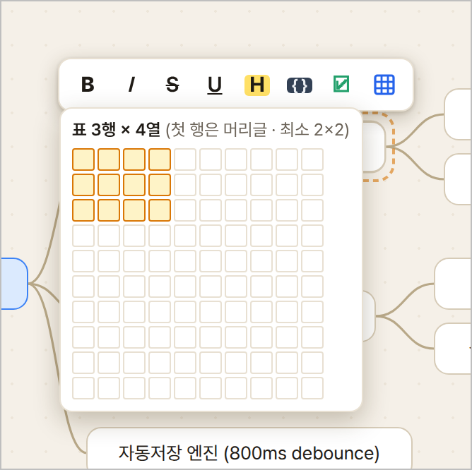

- **표 팝업** — 셀을 직접 입력합니다(Tab 으로 다음 칸). `+ 행` `− 행` `+ 열`
  `− 열` 은 **커서가 있는 셀 기준**입니다 — `+ 행` 은 그 행 아래에, `− 행` 은
  그 행을, `+ 열` 은 그 열 오른쪽에, `− 열` 은 그 열을 (머리글 행과 마지막
  데이터 행, 마지막 2열은 지울 수 없습니다). **확인(Ctrl+Enter)** 을 누르면
  노드에 들어갑니다. 셀 안의 `|` 는 Markdown 표준(GFM)대로 `\|` 로 저장되고 화면에는 `|` 로 보입니다.

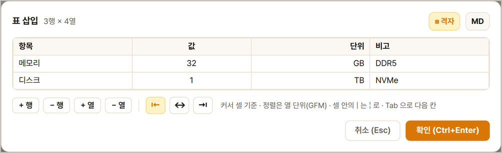

- **열 정렬** — 셀에 커서를 두고 `⇤` `↔` `⇥` 를 누르면 그 **열 전체**가
  왼쪽·가운데·오른쪽 맞춤이 됩니다. Markdown 표준(GFM)이 정한 방식이라
  구분선에 `:---:` 처럼 콜론으로 저장되고, 내보낸 MD 파일과 HTML 뷰어에서도
  같은 정렬로 보입니다 (셀 단위 정렬은 표준에 없습니다). 셀 안 글자 강조는
  `**굵게**` 처럼 인라인 마커를 그대로 쓰면 됩니다.
- 오른쪽 위의 **⊞ 격자 / MD** 버튼으로 **렌더된 격자와 Markdown 원문**을
  오가며 볼 수 있습니다(맵/아웃라인 보기 전환과 같은 모양). MD 보기에서
  파이프 표를 직접 고쳐도 되고, 다시 격자로 돌아오면 반영됩니다.

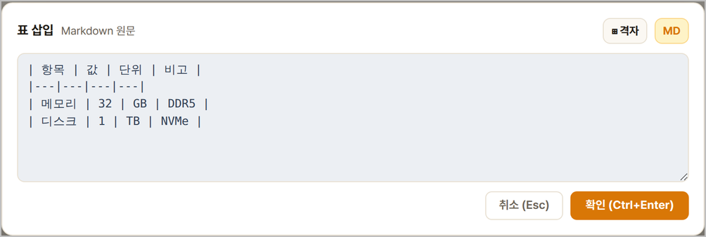

- **수정**: 노드의 표를 **더블클릭**하면 같은 팝업이 값이 채워진 채 열립니다.
  편집 중에 ⊞ 를 다시 누르면 삽입이 아니라 **첫 표**의 수정 팝업이 뜹니다.
  **아웃라인·칸반의 표 위 ✎** 를 눌러도 같은 팝업입니다.
- **표를 여러 개** 넣어도 됩니다 (2026-09-22) — 표 사이에 **빈 줄**을 두면
  원문 순서대로 모두 그려지고, 더블클릭한 그 표만 팝업에서 고쳐집니다.
  빈 줄 없이 바로 이어 쓰면 두 번째 표의 머리글이 첫 표의 행으로 읽힙니다
  (Markdown 규칙과 같습니다).

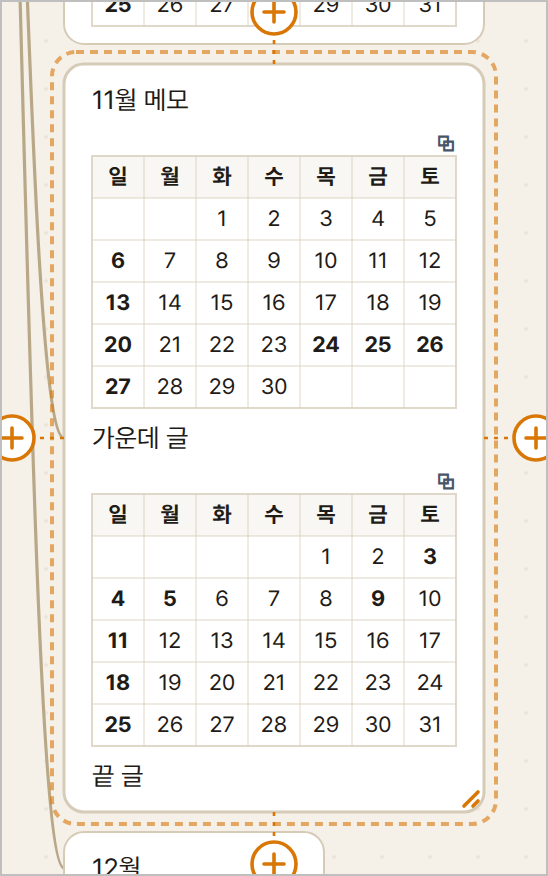

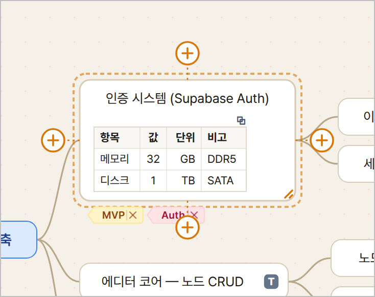

- 직접 타이핑해도 됩니다 — 노드에 `| 이름 | 값 |`처럼 파이프(|) 줄을 쓰면
  **격자 표**로 그려집니다 (첫 줄 = 머리글).
- **글 순서는 그대로** — 표 위에 쓴 글은 표 위에, 표 아래에 쓴 글
  (※ 첨부 안내 등)은 표 아래에 원문 순서 그대로 표시됩니다 (코드
  블록과 동일 규칙, 내보낸 HTML 뷰어도 동일).
- **웹 화면의 표를 그대로 붙여넣기** — 그룹웨어·웹 페이지에서 표가
  포함된 내용을 복사해 노드에 붙여넣으면(선택 후 `Ctrl+V` 또는 편집
  중 붙여넣기) 표가 **자동으로 파이프 표로 변환**되어 격자로
  그려집니다. 내부 저장이 Markdown이므로 **MD로 내보내면 MD 표
  형식 그대로** 저장됩니다.
- **복사 버튼은 어디서나 ⧉ 아이콘 하나** — 코드·표·노트 문단의
  복사 버튼은 모두 ⧉ 아이콘으로 통일되어 있고, 마우스를 올리면
  무엇이 복사되는지 안내가 뜹니다 (누르면 '복사됨 ✓').
- **표 복사(⧉)** — 노드 표·아웃라인/칸반 표·노트 표 팝업의 **표 바로
  위 오른쪽**에 있는 **⧉** 를 누르면 표가 복사됩니다 (아이콘은 표
  바깥 전용 줄에 있어 표 내용을 가리지 않습니다). **엑셀/시트에는 셀 단위로**,
  **웹 에디터(그룹웨어 등)·워드에는 테두리가 있는 표 그대로** 붙습니다
  (두 형식을 동시에 클립보드에 담고, 표에는 인라인 테두리 스타일이
  포함됩니다). 내보낸 HTML 뷰어에서도 동일합니다.

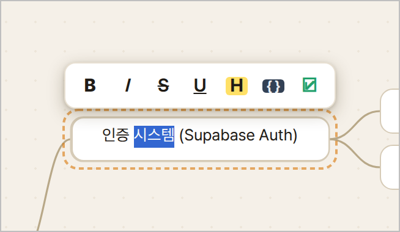

> 노드를 **더블클릭해 편집에 들어가면** 노드 위에 이 툴바가 뜹니다. 글자를
> 드래그로 고른 뒤 버튼을 누르면 그 구간에만 적용되고, 같은 버튼을 다시
> 누르면 풀립니다. `{ }` 는 코드 블록 팝업, `☑` 는 커서 줄을 체크 항목으로,
> `⊞` 는 격자에서 크기를 골라 표 팝업으로.


## 사진·기사 붙여넣기

- **그림 복사 후 붙여넣기**(`Ctrl+V`): 노드에 사진이 들어갑니다.
- **웹 기사 복사 후 붙여넣기**: 글과 사진이 **원래 순서 그대로** 노드에
  들어갑니다 (사진은 텍스트 중간 제자리에). 사진은 맵 파일에 **내장**되어
  기사가 사라져도 보존됩니다.
- 노드를 **선택만** 한 상태에서 붙여넣으면 → 그 아래 새 하위 노드가
  생기고 내용이 통째로 들어갑니다.
- 노드를 **편집 중**에 붙여넣으면 → 글자는 커서 위치에, 사진은 노드에
  함께 (저장 시 반영).

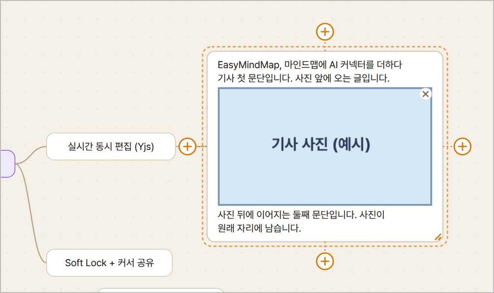

> 노드를 **선택만** 한 채 기사를 붙여넣은 결과입니다. 새 하위 노드 하나에
> 제목·첫 문단 → 사진 → 둘째 문단이 **원문 순서 그대로** 들어갑니다. 사진
> 오른쪽 위 `×` 로 그 사진만 뺄 수 있습니다.


### 노드를 끌어 옮기기 — 어디에 놓느냐가 전부입니다

- **노드 위(안쪽)에 놓으면 → 그 노드의 하위**로 들어갑니다.
  이때 대상 노드가 **초록 테두리로 감싸져** 보입니다.
- **노드 바깥 가장자리**에 놓으면 형제(이전/다음)나 상위가 됩니다 —
  가느다란 초록 바가 어느 변에 붙는지로 알 수 있습니다.
- 레이아웃(트리·진행트리·방사형)에 관계없이 **안쪽은 늘 하위**입니다.
  형제로 넣고 싶으면 노드 **밖으로** 조금 나가세요.
- 잘못 놓았어도 `Ctrl+Z` 로 되돌아갑니다.
