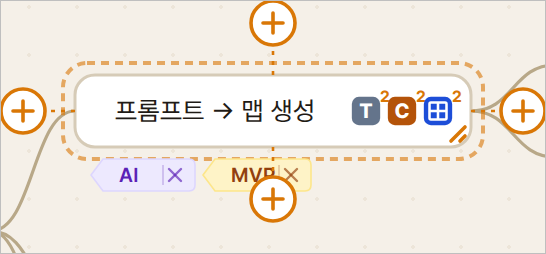
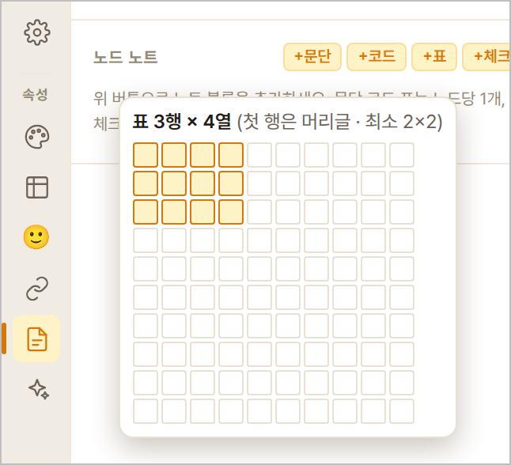
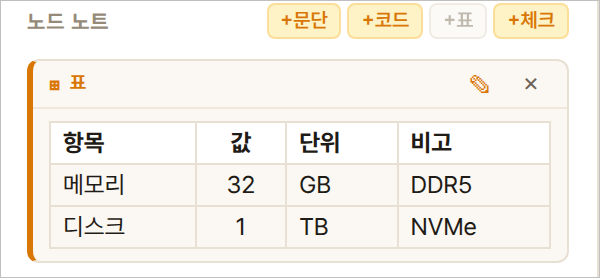
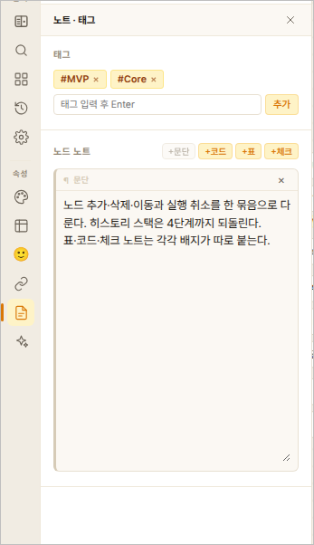
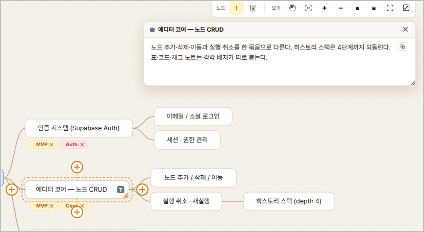
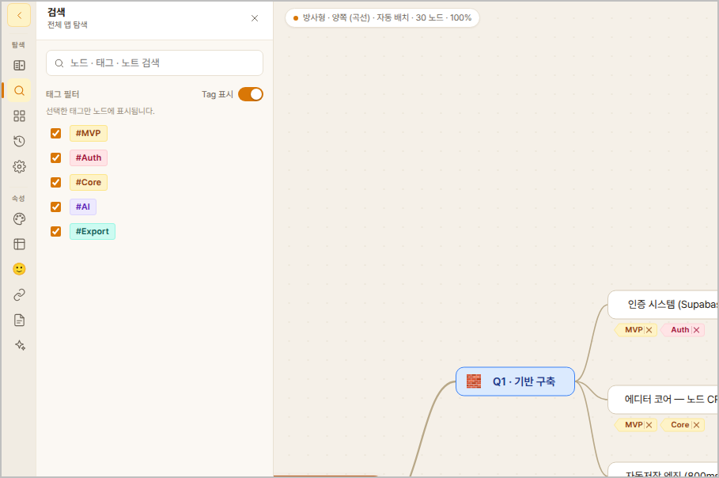

# 05. 노트 · 링크 · 첨부 · 태그

노드 자체(제목)는 짧게 두고, 자세한 내용은 **노트**로 붙입니다. 노드에
내용이 있으면 옆에 작은 **배지**가 표시되고, 배지를 누르면 열립니다.

## 노트 (문단 · 코드 · 표)

왼쪽 속성의 **`노트·태그` 탭**에서 추가합니다.

| 종류 | 용도 | 배지 |
|---|---|---|
| 문단 노트 | 설명 문장 | (문단 아이콘) |
| 코드 노트 | 명령어·설정 파일 | `C` |
| 표 노트 | 비교·속성 나열 | `⊞` |
| 체크 노트 | 할 일 목록 | ✓ |

- 문단·코드·표·체크 **모두 여러 개** 추가할 수 있습니다 (2026-09-22 —
  예전엔 문단·코드·표가 노드당 1개였습니다). 같은 종류가 둘 이상이면
  노드의 배지 오른쪽 위에 **개수**가 붙고(체크와 같은 규칙), 배지를 누르면
  그 종류의 노트가 모두 한 팝업에 순서대로 보입니다. 아웃라인·HTML
  내보내기의 배지에도 개수가 붙습니다.


- 노트 입력창은 기본 15줄로 넉넉합니다.
- 노트 안에서도 **굵게·형광펜** 같은 부분 강조가 됩니다.
- 노트 글자 크기는 **맵 설정**에서 바꿀 수 있습니다(기본 13pt).


- **웹 기사를 문단 노트에 붙여넣기** — 기사를 복사해 문단 입력창에
  `Ctrl+V` 하면 **사진과 서식이 함께** 들어가고, 입력창에는 문단별로
  줄이 나뉜 글이 보입니다(아래 미리보기에 사진). 붙여넣은 글을 **고쳐도
  사진은 남습니다** — 글은 고친 대로, 사진은 원래 자리에 다시 들어갑니다
  (굵게·링크 같은 글자 서식만 그때 풀립니다). 사진이 없는 붙여넣기는
  고치는 순간 일반 글이 됩니다.
- 노트 팝업의 **문단·코드·표에는 각각 ⧉ 복사 버튼**이 있습니다 —
  문단은 텍스트로, 코드는 원문으로, 표는 엑셀/웹 에디터 겸용 형식으로
  복사됩니다.

### 표 노트 — 격자에서 크기를 고르고 팝업에서 채웁니다 (2026-09-19)

노드 내용의 표(⊞)와 같은 방식입니다. 원문을 손으로 치지 않습니다.

1. `+표` 를 누르면 **10×10 격자**가 뜹니다. 마우스를 움직여 행×열을 고르고
   클릭합니다(첫 행은 머리글 · 최소 2×2).

   

2. **표 팝업**이 열립니다. 격자 칸에 바로 입력하고(`Tab` 으로 다음 칸),
   `+행 −행 +열 −열` 은 커서 칸 기준, `⇤ ↔ ⇥` 는 커서 열의 정렬입니다.
   오른쪽 위 **`⊞ 격자` / `MD`** 로 표를 Markdown 원문으로 보고 고칠 수도
   있습니다. `확인(Ctrl+Enter)` 으로 넣습니다.
3. 노트 탭에는 표가 **그려진 모양**으로 보입니다. 머리글의 **✎** 나 표
   **더블클릭**으로 같은 팝업에서 고칩니다.

   

- 셀 안의 `|` 는 그대로 써도 됩니다(저장할 때 `\|` 로 보존).
- 정렬(`⇤ ↔ ⇥`)은 노트 팝업·HTML 뷰어·MD 내보내기에도 그대로 갑니다.
- 예전에 원문으로 적어 둔 표 노트도 그려진 표로 보이고 ✎ 로 고칠 수
  있습니다. 표로 읽히지 않는 한 줄짜리 원문은 글 그대로 보입니다.





## 하이퍼링크

**`링크·첨부` 탭**에서 표시 이름과 주소(URL)를 넣습니다. 배지를 누르면
새 탭으로 열립니다. 브라우저 주소창의 자물쇠/URL을 끌어다 놓아도 됩니다.

- 링크가 **여러 개**면 🔗 아이콘을 눌렀을 때 **노드 오른쪽**에 목록이
  뜹니다. 마우스를 올린 항목은 **배경·굵게·↗ 로 강조**되어 어느 링크를
  고르는 중인지 한눈에 보이고, 잠시 기다리면 풀 URL 툴팁도 뜹니다.

## 첨부파일 · 멀티미디어

같은 `링크·첨부` 탭에서 문서·미디어 파일을 붙일 수 있습니다. 작은
파일(≤2MB)은 맵 파일 안에 함께 저장되어, 내보낸 뒤에도 열립니다.
**노드 위로 파일을 끌어다 놓아도** 붙습니다.

> Guest 체험 중에는 첨부파일을 쓸 수 없습니다 — 가입하면 열립니다.

### 큰 파일도 그냥 올리면 됩니다 (최대 1GB)

영상처럼 큰 파일은 **나눠서 올립니다.** 따로 골라야 할 메뉴는 없습니다 —
평소처럼 끌어다 놓거나 `미디어 선택`으로 고르면, 크기를 보고 알아서
처리합니다. 큰 파일이면 화면 아래에 진행률이 뜹니다.

```
🎬 발표영상.mp4  ▓▓▓▓▓░░░░░  52% (382MB / 734MB)  [취소]
```

- **[취소]** 를 누르면 즉시 멈추고, 올라가던 조각도 서버에서 정리됩니다.
- 중간에 통신이 잠깐 끊겨도 **끊긴 조각만 다시** 보냅니다 — 처음부터
  다시 올리지 않습니다.
- 다만 **페이지를 새로 고치면 처음부터**입니다(이어받기는 준비 중).
- 실제 한도는 **내 저장 용량**(문서+첨부 합산)이 먼저 걸립니다.
  아바타 메뉴의 📊 저장 용량에서 확인할 수 있습니다.

- 📎 아이콘의 목록도 링크와 같은 방식(노드 오른쪽 + 호버 강조)입니다.
- **PDF·사진·텍스트 파일**은 클릭하면 **브라우저 새 탭에서 바로**
  열립니다.
- **오피스 파일(Word·Excel·PPT)** 은 브라우저가 표시할 수 없어 클릭
  시 **바로 다운로드**됩니다 — 웹앱은 보안상 PC의 프로그램을 직접
  실행할 수 없습니다. 브라우저 다운로드 항목에서 **"항상 열기"를 켜
  두면** 다음부터 클릭 한 번으로 오피스가 열립니다. (서버 저장과
  연결되면 브라우저 안 Office 뷰어 연동을 검토합니다.)

## 태그

노드에 태그를 붙여 분류합니다. **검색 패널**의 "태그 필터"에서 `Tag 표시`를
켜면 맵에 태그가 보이고, 원하는 태그만 골라 표시할 수 있습니다.


