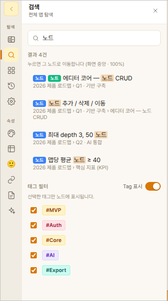
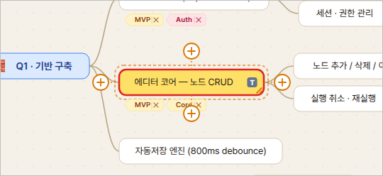

# 06. 검색

## 검색하기

1. 왼쪽 레일의 **돋보기(검색)** 아이콘을 누릅니다.
2. 검색창에 단어를 입력합니다. **노드 글자·태그·노트 내용·링크**를 모두
   찾습니다 (대소문자 구분 없음).
3. 아래에 **"결과 N건"** 과 목록이 나옵니다 (최대 50건 표시) —
   제목 **앞에 색 배지**로
   일치 위치가 표시됩니다: **[노드]**(파랑) **[태그]**(주황) **[노트]**(초록)
   **[링크]**(보라). 라이트/다크 모드 모두 같은 색이라 한눈에 구분됩니다.
   내보낸 HTML 뷰어의 검색도 동일합니다.

## 결과 클릭 → 이동 + 강조

결과를 클릭하면:
- 그 노드가 **화면 가운데 + 100% 보기**로 옵니다.
- **노란 채움 + 붉은 테두리**로 또렷하게 강조됩니다 (다크 모드에서도 잘
  보입니다).
- 접혀 있던 상위 노드는 자동으로 펼쳐집니다.

맵에서 다른 노드를 클릭하면 강조가 풀립니다.

## HTML 뷰어에서도 검색

내보낸 HTML 파일을 열어도 같은 검색이 됩니다. 헤더의 검색창에 입력 →
결과 클릭 → 중앙 이동·강조. `Enter`로 다음 결과로 넘어갑니다.
