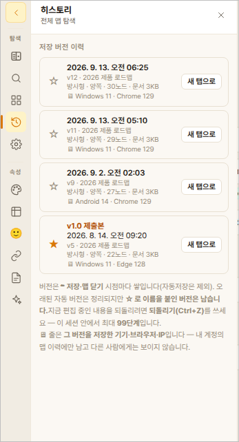
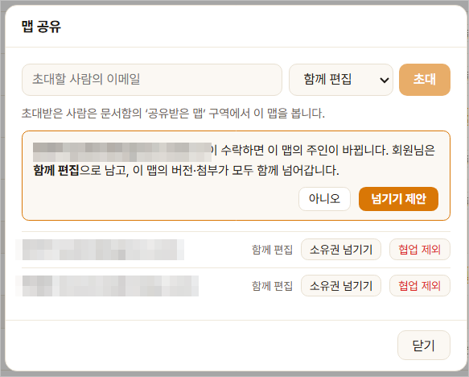

# 11. 버전 기록과 되돌리기

> 맵을 저장할 때마다 그 순간의 모습이 **버전**으로 남습니다.
> 잘못 고쳤을 때 되돌리고, 중요한 시점을 오래 보관하는 방법을 설명합니다.
>
> 관련: [08-내보내기-불러오기.md](08-내보내기-불러오기.md) · [12-협업.md](12-협업.md)

---

## 11.1 30초 요약

1. **저장할 때마다** 그 순간이 자동으로 기록됩니다. 따로 할 일은 없습니다
2. **되돌리려면** → 상단 `버전 기록` → 목록에서 시점 선택 → `이 버전으로 되돌리기`
3. **오래 남기려면** → 그 버전의 **☆ 별표**를 누르고 이름을 붙입니다
4. 별표를 붙인 버전은 **기간이 지나도 사라지지 않습니다**

---

## 11.2 버전이 만들어지는 때

| 상황 | 버전이 남나 |
|---|---|
| 저장 버튼을 누를 때 | ✅ |
| 맵을 닫을 때 | ✅ |
| 글자를 치는 동안 자동저장될 때 | ❌ |

> **왜 자동저장은 안 남기나요?**
> 글자 하나 칠 때마다 기록하면 버전이 수천 개가 되어 정작 필요한 시점을
> 찾을 수 없습니다. **의미 있는 매듭**만 남깁니다.

---

## 11.3 버전 기록 화면 보기

상단 메뉴에서 `버전 기록`을 누릅니다.


<!-- TODO(스크린샷): 버전 목록 · 별표 · 미리보기 -->

```
버전 기록
──────────────────────────────────────────
 ★  v1.0 제출본                08-14 18:20
 ☆  자동 저장                  09-02 15:25
 ☆  자동 저장                  09-02 14:10
 ☆  자동 저장                  09-02 11:03
```

- **★ (채워진 별)** — 오래 보관하도록 표시한 버전. 이름이 함께 보입니다
- **☆ (빈 별)** — 보통 버전. 기간이 지나면 정리됩니다

버전을 클릭하면 **그 시점의 맵을 미리 볼 수 있습니다.** 미리 보기만으로는
아무것도 바뀌지 않으니 편하게 눌러 보셔도 됩니다.

---

## 11.4 되돌리기

되돌리고 싶은 버전을 고르고 `이 버전으로 되돌리기`를 누릅니다.

> **지금 작업이 사라지지 않습니다.** 되돌리기는 되감는 것이 아니라
> **그 내용으로 새 버전을 만드는 것**입니다. 되돌린 다음 다시 마음이
> 바뀌면 방금 전 버전으로 또 되돌아갈 수 있습니다.

```
   [09-02 15:25]  ← 지금
   [09-02 14:10]
   [09-02 11:03]  ← 여기로 되돌리면
   ──────────────
   [09-02 16:40]  ← 이 내용으로 새 버전이 생깁니다 (위 셋은 그대로 남음)
```

---

## 11.5 오래 보관하기 (별표)

### 이럴 때 씁니다

- 제출본·확정본처럼 **나중에 반드시 다시 볼 시점**
- 큰 개편 직전의 모습
- 계약·발표처럼 **날짜가 의미 있는 시점**

### 방법

버전 목록에서 **☆ 별표**를 누릅니다. 이름을 물어봅니다.

```
┌─ 이 버전을 보관합니다 ────────────────────┐
│   이름  [2026-09-02 오후 3:25 버전       ] │
│         보관한 버전은 정리되지 않습니다      │
│                        [취소]   [보관]     │
└────────────────────────────────────────────┘
```

이름은 **그대로 두고 확인만 눌러도 됩니다.** 날짜가 기본으로 들어가 있습니다.
`v1.0 제출본`처럼 알아보기 쉬운 이름을 붙이면 나중에 찾기 좋습니다.

저장 직후에도 바로 보관할 수 있습니다.

```
저장됨 · 오후 3:25              [이 버전 보관]
```

### 보관을 풀려면

★ 별표를 다시 누릅니다. 이때 안내가 나옵니다.

> 보관을 해제하면 이 버전은 자동 정리 대상이 됩니다.
> 보관 기간(90일)이 이미 지난 버전이므로 다음 정리에서 삭제됩니다.

**보관 기간이 지난 버전은 해제하는 순간 곧 사라집니다.** 다시 볼 일이
있을지 한 번 더 생각하고 누르세요.

---

## 11.6 얼마나 오래 보관되나요

요금제마다 다릅니다.

| 요금제 | 자동 보관 | 별표 보관 |
|---|---|---|
| 무료 | 7일 | 3개 |
| Basic | **90일** | 20개 |
| Pro | **1년** | 50개 |
| Team | **1년** | 100개 |

**별표를 붙인 버전은 기간과 관계없이 남습니다.** 개수만 제한됩니다.

### 오래된 버전은 조금씩 성기게 남습니다

전부 그대로 쌓아 두면 목록이 수백 개가 되어 오히려 찾기 어렵습니다.
그래서 **최근 것은 촘촘하게, 오래된 것은 드문드문** 남깁니다.

| 언제 것 | 얼마나 |
|---|---|
| 최근 하루 | 전부 |
| 최근 일주일 | 하루에 3개쯤 |
| 최근 한 달 | 하루에 1개쯤 |
| 그 이전 | 일주일에 1개쯤 |

> **어제 오후 3시와 3시 20분**은 둘 다 남지만,
> **석 달 전 화요일과 수요일**은 둘 중 하나만 남습니다.
> 실제로 되돌릴 일은 최근 것이 대부분이기 때문입니다.

### 별표 개수가 다 찼다면

새로 보관하려 할 때 안내가 나옵니다.

```
보관 버전이 20개로 가득 찼습니다.
하나를 해제하고 이 버전을 보관하시겠습니까?

해제할 버전  [v0.3 초안  (07-12)  ▾]
                     [취소]   [교체하여 보관]
```

**작업이 막히지는 않습니다.** 저장은 평소대로 되고, 별표만 못 붙이는 것입니다.

---

## 11.7 정리 예고 알림

버전이 사라지기 **7일 전에** 미리 알려 드립니다.

```
┌─ 곧 정리되는 버전이 있습니다 ──────────────────┐
│   90일이 지난 버전 12개가 7일 뒤 정리됩니다.     │
│                                                 │
│   ☐  08-14 09:30                                │
│   ☐  08-15 14:20                                │
│   ☐  …                                          │
│                                                 │
│          [남길 항목 보관]     [그냥 정리]       │
└─────────────────────────────────────────────────┘
```

남기고 싶은 것에 체크하고 `남길 항목 보관`을 누르면 별표가 붙습니다.
**아무것도 안 해도 됩니다** — 그냥 두면 7일 뒤 정리됩니다.

---

## 11.8 요금제를 바꾸면

**낮은 요금제로 바꿔도 이미 있는 버전을 지우지 않습니다.**

- 보관 기간이 짧아지면, 기간이 지난 것부터 차례로 정리됩니다
- 별표가 새 개수 제한을 넘으면 **그대로 두고 새로 붙이는 것만 막습니다**

---

## 11.9 협업 맵의 버전

### 기준은 맵을 만든 사람입니다

여러 명이 함께 쓰는 맵에서는 **맵을 만든 사람(개설자)의 요금제**를 따릅니다.
참여자가 어떤 요금제든 상관없습니다.

> Pro 사용자가 만든 맵이라면, Basic 참여자가 편집해도 **1년 보관**됩니다.

### 별표는 누가 풀 수 있나요

| | 개설자 | 편집 참여자 | 보기 전용 |
|---|---|---|---|
| 별표 붙이기 | ✅ | ✅ | ❌ |
| **별표 풀기** | ✅ | **자기가 붙인 것만** | ❌ |

남이 `제출본`이라고 표시해 둔 것을 다른 사람이 마음대로 풀 수 없습니다.

---

## 11.10 소유권 넘기기

담당자가 바뀌거나 다른 팀으로 넘길 때 씁니다.

### 넘기는 사람 (개설자)

`맵 설정` → `소유권 넘기기` → 참여자 중에서 선택합니다.


<!-- TODO(스크린샷): 참여자 선택 · 이전 항목 안내 -->

```
┌─ 소유권 이전 ─────────────────────────────────┐
│   "2027 사업계획" 을 김철수님께 넘깁니다.       │
│                                                │
│   함께 이전    최신 내용 · 첨부파일 · 보관 12개│
│   이전 안 됨   자동 버전 87개                  │
│                                                │
│   ⚠️ 자동 버전은 넘어가지 않습니다.             │
│      30일간 회원님 계정에 남으며 그 후 정리됩니다.│
│      필요하면 지금 내려받으세요.                │
│                                                │
│              [히스토리 ZIP 내려받기]           │
│                                                │
│                   [취소]   [이전 제안]         │
└────────────────────────────────────────────────┘
```

### ⚠️ 무엇이 넘어가고 무엇이 안 넘어가나요

| | 넘어감 |
|---|---|
| 맵의 현재 내용 | ✅ |
| 첨부파일·사진 | ✅ |
| **★ 별표 붙인 버전** | ✅ |
| ☆ 보통 버전 (자동 기록) | **❌** |

**별표를 붙여 둔 버전은 함께 넘어갑니다.** 직접 표시해 둔 것이니까요.
보통 버전은 넘어가지 않지만 **바로 지워지지도 않습니다** — 30일간 원래
계정에 남아 있고, 그동안 언제든 내려받을 수 있습니다.

### 히스토리 ZIP 내려받기

버전 전체를 파일로 받아 둘 수 있습니다.

```
2027-사업계획_history_20260902.zip
├─ README.md                        무엇이 들었는지 설명
├─ ★ v1.0 제출본 (2026-08-14).md
├─ 2026-08-14 0930.md
├─ 2026-08-15 1420.md
│  …
└─ files/                           사진·첨부파일
```

- 버전마다 **마크다운(.md) 파일**이 하나씩 들어 있습니다
- 사진과 첨부는 `files/` 폴더에 함께 담깁니다
- **인터넷이 없어도 열립니다.** 메모장이나 Obsidian 같은 프로그램으로
  바로 읽을 수 있습니다

> 버전이 많으면 만드는 데 시간이 걸립니다. 준비가 끝나면 알림이 오고,
> **7일 안에** 내려받으시면 됩니다.

### 받는 사람

제안을 받으면 알림이 옵니다. **수락해야 넘어옵니다.**

```
┌─ 소유권 이전 제안 ───────────────────────────┐
│   홍길동님이 "2027 사업계획" 의 소유권을      │
│   회원님께 넘기려 합니다.                     │
│                                              │
│   이 맵 용량      3.4 GB                     │
│   회원님 여유     6.6 GB / 10 GB             │
│   이전 후         9.99 GB / 10 GB   ⚠️       │
│                                              │
│   ⚠️ 회원님 요금제(Basic)는 버전을 90일        │
│      보관합니다. 보관 12개는 유지됩니다.       │
│                                              │
│             [거절]        [수락]             │
└──────────────────────────────────────────────┘
```

**용량이 모자라면 수락할 수 없습니다.**

```
용량이 모자라서 권한 이양이 불가합니다.
필요 3.4 GB / 여유 2.1 GB
```

이때는 다른 파일을 정리하거나 요금제를 올린 뒤 다시 시도하세요.

### 넘긴 다음

- 원래 개설자는 **편집 참여자로 남습니다.** 자동으로 나가지 않습니다.
  맵은 계속 함께 쓸 수 있고, 나가는 것은 본인이 결정합니다
- 보관 기간이 **새 개설자 요금제로 바뀝니다**

---

## 11.11 자주 묻는 것

**Q. 실수로 되돌렸어요.**
되돌리기는 되감는 것이 아니라 새 버전을 만드는 것입니다. 버전 기록에서
바로 앞 버전을 골라 다시 되돌리면 됩니다.

**Q. 버전이 사라졌어요.**
보관 기간이 지난 것입니다. 정리 7일 전에 알림을 보내드립니다.
중요한 시점은 **★ 별표**를 붙여 두세요.

**Q. 별표는 몇 개까지 되나요?**
요금제마다 다릅니다 (§11.6). 다 차면 하나를 풀고 새로 붙일 수 있습니다.

**Q. 맵을 지우면 버전도 지워지나요?**
휴지통으로 함께 갑니다. 30일 안에 복원하면 버전도 같이 돌아옵니다.

**Q. 별표 버전도 용량을 차지하나요?**
네. 보관 중인 버전도 용량에 포함됩니다.

**Q. 소유권을 넘겼는데 되돌리고 싶어요.**
새 개설자가 다시 넘겨 주어야 합니다. 넘긴 사람은 편집 참여자로 남아 있으니
맵 자체는 계속 쓸 수 있습니다.
