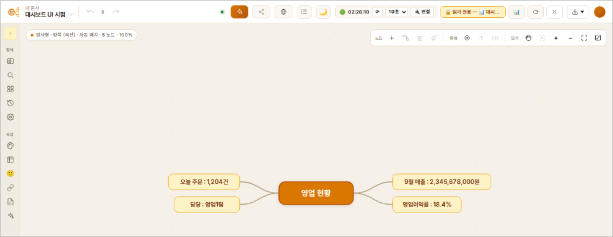
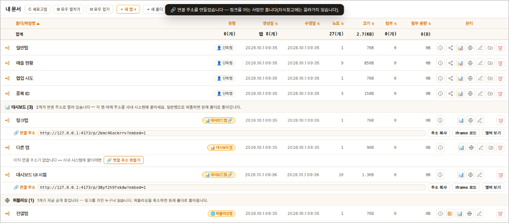
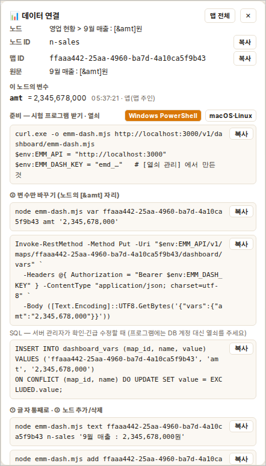
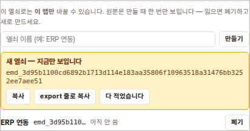
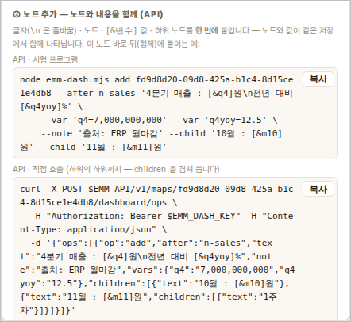
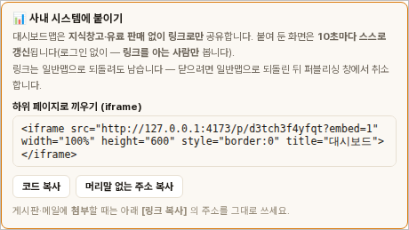
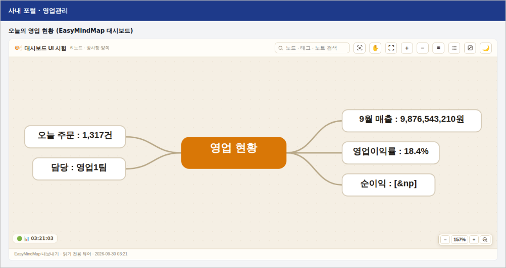

# 13. 대시보드맵 — 프로그램이 노드 내용을 바꾸는 맵

매출·재고·주문 수처럼 **자주 바뀌는 숫자**를 마인드맵 위에 띄워 두고, 사람이 아니라
**프로그램(ERP·모니터링 스크립트·엑셀 매크로 등)이 값을 넣게** 하는 기능입니다.
프로그램이 값을 넣으면 맵을 열어 둔 화면이 **10초 안에 저절로 바뀌고, 바뀐 노드가
노랗게 깜빡입니다.**

> **유료 기능입니다.** 서버의 라이선스에 `dashboard` 가 들어 있어야 [📊 대시보드맵으로]
> 단추가 보입니다. 유료 기능이 꺼진 서버에서도 **이미 대시보드맵인 맵을 일반맵으로
> 되돌리는 것은 언제나 됩니다**(내 맵이 잠긴 채 갇히지 않습니다).



---

## 1. 노드 내용을 바꾸는 세 가지 방법

| 방법 | 언제 쓰나 | 예 |
|---|---|---|
| **① 노드 글자 통째로** | 문장 전체를 프로그램이 만든다 | 노드 ID `node-k3f9a2` 의 글자를 `2026년 9월 매출 : 23억원` 으로 |
| **② 변수 자리만** | 문장은 사람이 쓰고 **숫자만** 바뀐다 | 노드 글자 `9월 매출 : [&amt]원` → `amt` 에 `2,345,678,000` 을 넣으면 `9월 매출 : 2,345,678,000원` |
| **③ 노드 추가 · 삭제** | 항목 수가 바뀐다 | 어떤 노드의 **하위**로, 또는 **바로 앞 · 바로 뒤 형제**로 새 노드를 붙이거나 지운다 — 붙일 때 **글자(여러 줄)·노트·변수 값·하위 노드까지 한 번에** |

**변수 `[&이름]` 규칙**

- 노드 글자 안에 `[&amt]` 처럼 적습니다. 이름은 한글·영문·숫자·`_`·`.` (첫 글자는 숫자가
  아닌 것), 40자까지.
- 변수는 **맵 전체에서 하나**입니다 — `[&amt]` 를 두 노드에 적으면 두 곳이 함께 바뀝니다.
- 아직 값이 없는 변수는 `[&amt]` 그대로 보입니다.
- 값에 `**굵게**` 같은 표시를 넣어도 **글자 그대로** 보입니다(값이 노드 모양을 바꾸지
  못하게). 노드 모양을 바꾸려면 ① 통째로 바꾸기를 쓰세요.
- ★ 값이 길어지면 노드도 넓어집니다 — 자주 바뀌는 숫자는 **자릿수가 크게 달라지지 않게**
  보내면 맵이 덜 흔들립니다(예: 항상 `1,234,567,000` 처럼 쉼표를 넣은 같은 단위).

---

## 2. 대시보드맵 만들기

1. 평소처럼 맵을 만들고, 숫자가 들어갈 자리에 `[&이름]` 을 적어 둡니다.
   예) `9월 매출 : [&amt]원` · `영업이익률 : [&op]` · `오늘 주문 : [&orders]건`
2. 전환합니다 — 둘 중 편한 곳에서:
   - **맵을 연 채로**: 위 도구줄의 **[📊 대시보드맵으로]**
   - **문서함에서**: 그 맵 줄의 **📊** 단추
3. 확인 창에서 **[확인]**. 맵이 **읽기 전용**으로 다시 열리고, 도구줄에
   `🔒 읽기 전용 — 📊 대시보드맵 …` 배지와 자동 갱신 표시가 붙습니다.

**전환이 안 되는 맵** (서버가 이유를 그대로 알려 줍니다)

| 맵 | 이유 |
|---|---|
| 지식창고에 올렸거나 유료로 파는 맵 | 지식창고에서 내리거나 무료로 돌리세요 — **링크 공개는 그대로 둬도 됩니다**(7장) |
| 협업맵 | 지금은 **단독맵만** 대시보드맵이 됩니다 |
| 같은 ID 의 노드가 있는 맵 | 프로그램이 가리킬 노드가 겹칩니다 — 맵을 한 번 열어 저장한 뒤 다시 |

문서함에서는 대시보드맵이 폴더가 아니라 **📊 대시보드** 구역에 따로 모입니다. 사내 시스템에 붙일
주소는 그 줄의 **🌐 퍼블리싱**을 누르면 나옵니다(7장). 일반맵으로 되돌리면 원래 폴더로 돌아갑니다.



---

## 3. 열어 둔 화면 — 자동 갱신

도구줄의 작은 표시가 자동 갱신 상태입니다.

| 표시 | 뜻 |
|---|---|
| 🟢 `14:32:27` | **지금 시각**입니다 — 시계처럼 매초 넘어갑니다. 서버 확인은 뒤에서 10초 간격이면 시계 눈금 **:00 · :10 · :20 …** 에 맞춰 합니다(30초는 :00·:30, 1분은 매분 :00, 5분은 5분 단위). 마지막 확인·마지막 변경 시각은 마우스를 올리면 보입니다 |
| ⏳ | 지금 서버에 묻는 중 |
| ⚠️ | 서버에 묻지 못했거나, **확인이 멈췄다**(마지막 확인이 간격의 2배 넘게 지났다) — 마우스를 올리면 이유가 보입니다 |
| **⟳** | 기다리지 않고 지금 다시 받기 |
| **10초 ▾** | 간격 — 끔 · 10초 · 30초 · 1분 · 5분. **이 브라우저에만** 기억합니다 |
| **🔌 연결** | [데이터 연결] 카드 열기·닫기 (4장) |

- 바뀐 것이 있을 때만 문서를 다시 받습니다(10초마다 맵 전체를 받지 않습니다).
- **글자가 바뀐 노드와 새로 붙은 노드는 2초 동안 노랗게 깜빡입니다.**
- 탭을 다른 창 뒤로 보내면 멈추고, 돌아오면 바로 한 번 읽습니다.
- 대시보드맵은 **화면에서 고칠 수 없습니다**(퍼블리싱한 맵과 같습니다). 고치려면
  [일반맵으로 되돌리기] 를 한 뒤 고치고, 다시 전환하세요.

---

## 4. [🔌 데이터 연결] — 프로그램에 넣을 정보

대시보드맵에서 **노드를 클릭하면** 오른쪽에 카드가 뜹니다(도구줄의 **🔌 연결** 로도
엽니다).



| 칸 | 무엇 |
|---|---|
| 노드 · 노드 ID | 사람이 읽는 경로(`영업 현황 > 9월 매출 : [&amt]원`)와 프로그램이 쓰는 ID |
| 맵 ID | 모든 명령에 들어가는 맵 번호 |
| 원문 | 변수 자리 `[&amt]` 가 든 **저장된 글자** |
| 이 노드의 변수 | 이름 = 지금 값 · 언제 · 누가(`key:emd_…` 열쇠 / `user:…` / `sql`) |
| 명령 | `emm-dash` · `curl` · SQL 을 **이 맵·이 노드 값으로 채워** 보여 줍니다 — [복사] 해 그대로 씁니다 |

- 노드를 고르지 않고 열면 **맵의 변수 전체 표**가 나옵니다 — **값 없음**(노드에는 있는데 아직
  안 넣은 변수)과 **안 쓰임**(값만 있고 어느 노드에도 없는 변수)을 주황으로 표시합니다.
- **[⬇ 노드·변수 목록 (JSON)]** — 맵의 모든 노드 ID·경로·원문·변수를 파일로 받습니다.
  프로그램을 짤 때 이 파일을 보고 노드 ID 를 고르면 됩니다.

---

## 5. 열쇠 만들기 — 프로그램의 출입증

프로그램은 로그인하지 않습니다. 대신 **이 맵 전용 열쇠**(`emd_…`)를 씁니다.

1. [데이터 연결] 카드 아래 **[🔑 이 맵의 열쇠]** 를 누릅니다.
2. 이름(예: `ERP 연동`)을 적고 **[만들기]**.
3. 주황 상자에 **열쇠 원문이 한 번만** 보입니다 — **[환경 변수 줄로 복사]** 해 프로그램 쪽에
   넣어 두세요. 창을 닫으면 다시 볼 수 없습니다(서버는 원문을 갖고 있지 않습니다).



- 이 열쇠로는 **이 맵만** 바꿀 수 있습니다. 다른 맵·다른 사용자 데이터에 닿지 못합니다.
- 잃어버렸거나 새어 나갔으면 **[폐기]** — 그 열쇠를 쓰던 프로그램은 바로 막힙니다.
- 열쇠 만들기·폐기는 **맵 주인만**(로그인해서) 할 수 있습니다.

---

## 6. 시험해 보기 — `emm-dash`

`emm-dash` 는 Node.js 18 이상만 있으면 도는 **파일 하나짜리** 시험 프로그램입니다.
카드의 **준비** 칸 오른쪽에서 **[Windows PowerShell | macOS·Linux]** 를 고르면 그 셸에 맞는
명령이 나옵니다(처음에는 브라우저로 짐작합니다). 한 줄씩 붙여넣으세요.

**Windows PowerShell**

```powershell
curl.exe -o emm-dash.mjs https://api-dev.mindmap.ai.kr/v1/dashboard/emm-dash.mjs
$env:EMM_API = "https://api-dev.mindmap.ai.kr"
$env:EMM_DASH_KEY = "emd_…"        # 5장에서 만든 열쇠 — 이 창에서만 유효합니다
```

> ★ PowerShell 에서는 `export` 가 없고, `curl` 이 **다른 명령(Invoke-WebRequest)의 별명**이라
> `-O` 를 모릅니다(물어보는 `Uri:` 에 아무거나 넣으면 "원격 서버에 연결할 수 없습니다" 가 납니다).
> 진짜 curl 인 **`curl.exe`** 를 쓰세요(Windows 10 이상에 들어 있습니다). 받기가 막히면 브라우저로
> 같은 주소를 열어 `emm-dash.mjs` 이름으로 저장해도 됩니다.

**macOS · Linux (bash·zsh)**

```bash
curl -o emm-dash.mjs https://api-dev.mindmap.ai.kr/v1/dashboard/emm-dash.mjs
export EMM_API=https://api-dev.mindmap.ai.kr
export EMM_DASH_KEY=emd_…          # 5장에서 만든 열쇠
```

아래 `node emm-dash.mjs …` 명령은 **두 셸에서 같습니다.** 값에 띄어쓰기가 있으면 따옴표로
감쌉니다(`"…"` 은 둘 다 됩니다).

```bash
node emm-dash.mjs nodes <맵ID>                               # 노드 ID · 경로 · 원문 · 채운 글자
node emm-dash.mjs vars  <맵ID>                               # 변수 · 값 · 쓰는 노드 수

# ② 변수만
node emm-dash.mjs var   <맵ID> amt "2,345,678,000"           # 여러 개: amt "…" op "18.4%"

# ① 통째로
node emm-dash.mjs text  <맵ID> <노드ID> "2026년 9월 매출 : 23억원"

# ③ 추가 · 삭제
node emm-dash.mjs add   <맵ID> --parent <노드ID> "세부 항목"           # 하위 (맨 끝, --index 0 이면 맨 앞)
node emm-dash.mjs add   <맵ID> --after  <노드ID> "10월 매출 : [&amt10]원"  # 형제 — 바로 뒤
node emm-dash.mjs add   <맵ID> --before <노드ID> "8월 매출 : [&amt08]원"   # 형제 — 바로 앞
node emm-dash.mjs del   <맵ID> <노드ID>                       # 하위까지 지운다

# ③ 노드를 내용째 — 여러 줄 글자 · 노트 · 변수 값 · 하위 노드를 한 번에
node emm-dash.mjs add   <맵ID> --after <노드ID> "4분기 매출 : [&q4]원\n전년 대비 [&q4yoy]%" \
     --var q4=7,000,000,000 --var q4yoy=12.5 --note "출처: ERP 월마감" --child "10월" --child "11월"

# 깜빡임 구경 — amt 를 3초마다 5번 바꾼다 (맵을 열어 두고)
node emm-dash.mjs demo  <맵ID> amt --count 5 --every 3
```

- 노드는 **노드 ID** 로 가리키는 것이 기본입니다. ID 대신 **경로**
  (`"영업 현황 > 9월 매출 : [&amt]원"`)도 되지만, 같은 경로가 둘이면 거절합니다.
- 성공하면 `✅ …`, 실패하면 `✖ 409 [OP_FAILED] …` 처럼 서버가 말한 이유와 함께
  **종료코드 1** 로 끝납니다 — cron·스크립트가 실패를 알 수 있습니다.
- **지우기**가 든 변경은 지우기 **전** 맵을 [버전 기록]에 남깁니다(잘못 지웠을 때 되살릴 수
  있게).
- 여러 변경을 한 번에 보내면(`ops`) **전부 되거나 전부 안 됩니다** — 반쯤 바뀐 대시보드는
  만들어지지 않습니다.

### 노드를 **내용째** 추가하기

노드 하나만 덩그러니 붙이는 것이 아니라, 그 노드의 **내용을 함께** 붙입니다.

| 넣는 것 | `emm-dash` | API (`ops` 의 `add`) |
|---|---|---|
| 여러 줄 글자 | 글자 안에 `\n` (두 글자) | `"text": "첫 줄\n둘째 줄"` |
| 노트 | `--note "출처: ERP"` | `"note": "출처: ERP"` |
| 변수 값 | `--var q4=7,000,000,000` (여러 번) | `"vars": {"q4": "7,000,000,000"}` |
| 하위 노드 | `--child "10월"` (여러 번) | `"children": [{"text": "10월"}, …]` |
| 하위의 하위까지 | `--file 노드.json` | `children` 안에 다시 `children` |

- 노드와 변수 값은 **같은 저장**에서 들어갑니다 — 화면에 `[&q4]` 가 잠깐 보였다가 숫자로 바뀌는
  일이 없습니다. 같이 보낸 변경 중 하나라도 틀리면 노드도 값도 들어가지 않습니다.
- `--file` 의 모양: `{"text": "4분기 매출 : [&q4]원", "note": "…", "vars": {"q4": "…"}, "children": [{"text": "10월", "children": [{"text": "1주차"}]}]}`
- 한 번에 새 노드 500개, 하위 깊이 20단계까지입니다.
- 카드(4장)를 열면 그 노드에 맞춘 명령이 **③ 노드 추가 — 노드와 내용을 함께** 칸에 나옵니다.



### 다른 프로그램에서 — `curl` / PowerShell

카드의 명령 칸도 고른 셸에 맞춰 나옵니다. PowerShell 은 `Invoke-RestMethod` 이고, 본문을 **UTF-8
바이트**로 보냅니다(Windows PowerShell 5.1 은 글자 본문의 한글이 깨집니다).

```powershell
Invoke-RestMethod -Method Put -Uri "$env:EMM_API/v1/maps/<맵ID>/dashboard/vars" `
  -Headers @{ Authorization = "Bearer $env:EMM_DASH_KEY" } -ContentType "application/json; charset=utf-8" `
  -Body ([Text.Encoding]::UTF8.GetBytes('{"vars":{"amt":"2,345,678,000","op":"18.4%"}}'))
```

bash:

```bash
# ② 변수
curl -X PUT $EMM_API/v1/maps/<맵ID>/dashboard/vars \
  -H "Authorization: Bearer $EMM_DASH_KEY" -H "Content-Type: application/json" \
  -d '{"vars":{"amt":"2,345,678,000","op":"18.4%"}}'

# ① · ③ 여러 변경을 한 번에
curl -X POST $EMM_API/v1/maps/<맵ID>/dashboard/ops \
  -H "Authorization: Bearer $EMM_DASH_KEY" -H "Content-Type: application/json" \
  -d '{"ops":[{"op":"text","node":"<노드ID>","text":"9월 매출 : 23억원"},
              {"op":"add","after":"<노드ID>","text":"10월 매출 : [&amt10]원"}]}'

# ③ 노드를 내용째 — 여러 줄 · 노트 · 변수 값 · 하위
curl -X POST $EMM_API/v1/maps/<맵ID>/dashboard/ops \
  -H "Authorization: Bearer $EMM_DASH_KEY" -H "Content-Type: application/json" \
  -d '{"ops":[{"op":"add","after":"<노드ID>","text":"4분기 매출 : [&q4]원\n전년 대비 [&q4yoy]%",
              "note":"출처: ERP 월마감","vars":{"q4":"7,000,000,000","q4yoy":"12.5"},
              "children":[{"text":"10월 : [&m10]원"},{"text":"11월 : [&m11]원"}]}]}'
```

### DB 에 직접 — SQL 한 줄

프로그램이 이미 **DB 안에서** 돈다면(ERP 배치·DB 트리거·SQL 작업) API 대신 SQL 한 줄로 바꿀 수
있습니다. 함수 두 개가 API 와 **같은 규칙**을 지킵니다(대시보드맵만 · 이름·길이 규칙 · 틀리면
아무것도 안 바뀜). 화면은 10초 안에 알아챕니다.

```sql
-- ② 변수 하나 — 처음이든 두 번째든 같은 한 줄입니다
SELECT dashboard_set_var('<맵ID>', 'op', '123,456원');

-- ① 노드 글자 통째로 — 노드는 [데이터 연결] 카드의 "노드 ID" 로
SELECT dashboard_set_text('<맵ID>', '<노드ID>', '영업이익율 : 123,456원');
```

성공하면 `✅ op = 123,456원` / `✅ 노드 … 글자를 바꿨습니다` 가 돌아오고, 틀리면 이유와 함께
오류가 납니다(`맵에 없는 노드 ID 입니다` · `대시보드맵이 아닙니다` 등).

**`INSERT` 는 한 번만, 그 뒤는 `UPDATE` 만 하면 되나요?** — 표에 직접 쓰면 그렇습니다.
`dashboard_vars` 는 (맵, 이름) 한 칸에 값 하나라, 행이 없을 때는 `INSERT`, 있을 때는 `UPDATE` 입니다.

```sql
INSERT INTO dashboard_vars (map_id, name, value) VALUES ('<맵ID>', 'op', '123,456원');   -- 처음 한 번
UPDATE dashboard_vars SET value = '123,457원' WHERE map_id = '<맵ID>' AND name = 'op';     -- 그 뒤
```

다만 두 가지를 조심해야 합니다 — 행이 없는데 `UPDATE` 하면 **오류 없이 0건**이라 모르고
지나가고, 이미 있는데 `INSERT` 하면 중복 오류가 납니다. 그래서 **`dashboard_set_var`(위)나
아래 한 줄**(있으면 고치고 없으면 넣는다)을 권합니다 — 처음과 다음을 가를 필요가 없습니다.

```sql
INSERT INTO dashboard_vars (map_id, name, value) VALUES ('<맵ID>', 'op', '123,456원')
ON CONFLICT (map_id, name) DO UPDATE SET value = EXCLUDED.value;
```

노드 **글자 통째로**는 표 한 칸이 아니라 문서(JSON) 속에 있어서 손 SQL 로 고치기 어렵습니다 —
**`dashboard_set_text` 를 쓰세요.**

> ★ **DB 계정은 모든 맵·모든 사용자 데이터에 닿습니다.** 외부 프로그램(다른 서버·PC)에는 DB
> 계정 대신 **맵 열쇠 + API** 를 주세요. SQL 은 DB 안에서 이미 도는 작업과 서버 관리자를 위한
> 길입니다. DB 에 직접 넣을 때는 **열쇠가 필요 없습니다**(DB 계정으로 들어가므로).

### 한눈에 — 세 가지 길 × 두 가지 일

| | ② 변수 값만 (`[&op]` 자리) | ① 노드 글자 통째로 | 인증 |
|---|---|---|---|
| **시험 프로그램** `emm-dash` | `node emm-dash.mjs var <맵> op "123,456원"` | `node emm-dash.mjs text <맵> <노드ID> "영업이익율 : 123,456원"` | 맵 열쇠 |
| **API 직접 호출** (다른 프로그램) | `PUT /v1/maps/<맵>/dashboard/vars` `{"vars":{"op":"123,456원"}}` | `POST /v1/maps/<맵>/dashboard/ops` `{"ops":[{"op":"text","node":"<노드ID>","text":"…"}]}` | 맵 열쇠 (`Authorization: Bearer emd_…`) |
| **DB 에 직접** (SQL) | `SELECT dashboard_set_var('<맵>','op','123,456원');` | `SELECT dashboard_set_text('<맵>','<노드ID>','…');` | DB 계정 (열쇠 없음) |

- **`emm-dash`** 는 API 를 부르는 **작은 시험 프로그램**입니다 — 명령 한 줄로 API 를 대신 불러 줍니다.
  실제 연동 프로그램은 두 번째 줄(API 직접 호출)을 자기 언어(Java·Python·C#·엑셀 VBA …)로 부르면 됩니다.
- **변수**를 쓰면 문장은 사람이 쓴 그대로 두고 숫자만 바뀝니다 — 자주 바뀌는 값에 맞습니다.
  **통째로**는 `[&op]` 자리까지 덮어써서, 그 뒤로는 `op` 를 넣어도 그 노드가 바뀌지 않습니다
  (다시 `영업이익율 : [&op]` 로 통째로 넣으면 변수 자리가 돌아옵니다).

### 열쇠는 꼭 필요한가요? — **API 로 넣을 때만, 맵에 하나**

- 열쇠는 **맵 단위**입니다 — 한 맵에 하나 만들면 그 맵의 **모든 노드·모든 변수**에 씁니다. 노드마다
  만들 필요가 없습니다(카드가 노드를 고를 때 뜨지만 [🔑 이 맵의 열쇠] 는 맵 전체의 것입니다).
- API 는 인터넷에 열려 있는 문이라 **누가 부르는지** 가려야 합니다. 로그인한 맵 주인이 아니면 그 맵의
  열쇠가 있어야 합니다 — 열쇠가 없으면 누구나 남의 대시보드를 바꿀 수 있게 됩니다.
- 프로그램이 여러 개면(ERP · 모니터링) **프로그램마다 열쇠를 하나씩** 만들어 두면 좋습니다 — 한 쪽이
  새어 나가도 그 열쇠만 [폐기] 하면 됩니다. 필수는 아닙니다.
- **DB 에 직접**(SQL) 넣을 때는 열쇠가 필요 없습니다 — DB 계정이 이미 더 큰 권한입니다.

---

## 7. 사내 시스템에 붙이기 — 링크 퍼블리싱

대시보드맵을 **사내 게시판·메일에 첨부**하거나, 기존 시스템의 **하위 페이지로 끼워** 둘 수
있습니다. 퍼블리싱 링크를 그대로 씁니다 — 지식창고에는 올라가지 않고 **링크를 아는 사람만**
봅니다. 붙여 둔 화면은 **10초마다 스스로 갱신**됩니다(아무도 새로고침을 누르지 않아도).

1. 문서함의 **📊 대시보드** 구역에서 그 맵 줄의 **🌐 퍼블리싱**을 누릅니다(맵을 열지 않아도 됩니다).
   맵을 열어 둔 채라면 도구줄의 🌐 도 같습니다.
2. **[🔗 링크 만들기]** 를 누릅니다 — 바로 링크 공개가 됩니다. 대시보드맵의 퍼블리싱 창에는
   비공개(보관)·링크 공개 전환과 [퍼블리싱 취소] 단추가 없습니다(필요 없는 단계라 뺐습니다).
3. 창에 **📊 사내 시스템에 붙이기** 칸이 나옵니다.
   - **첨부**: 아래 **[링크 복사]** 의 주소(`https://…/p/abcd…`)를 붙여 넣습니다.
   - **하위 페이지**: **[코드 복사]** 로 받은 `<iframe …?embed=1 …>` 를 사내 페이지 HTML 에 넣습니다.
     `?embed=1` 이 붙은 주소는 위쪽의 돌아가기 막대 없이 맵만 보여 줍니다.





- 붙인 화면(그리고 **새 탭에서 열기** 한 화면)의 **맨 아래 줄 가운데**에 대시보드맵을 열었을 때와 같은 표시가
  있습니다: `🟢 📊 14:32:27  ⟳  [10초▾]`.
  - 시각은 **지금 시각**(매초)입니다. 🟢 정상 · ⏳ 확인 중 · ⚠️ 서버에 닿지 못하거나 확인이 멈춤 —
    ⚠️ 일 때는 마지막으로 받은 값을 그대로 보여 줍니다.
  - **⟳** 는 지금 바로 다시 받습니다. **[10초▾]** 로 간격을 고릅니다(끔·10초·30초·1분·5분) — 이
    브라우저만 기억하고, 대시보드맵 편집 화면의 간격과 같은 설정입니다. 끔이면 ⟳ 를 누를 때만 받습니다.
  - 서버 확인은 시계 눈금(:00·:10·:20…)에 맞춰 합니다. 마우스를 올리면 마지막 확인·마지막 변경 시각이 보입니다.
- 내용이 바뀌어 다시 그릴 때 **확대·위치는 처음으로** 돌아갑니다.
- 문서함 유형 칸에는 `📊 대시보드맵 🔗`(링크 공개) · `📊 대시보드맵 🔒`(보관)로 보입니다 — 배지를 누르면
  첨부용 보통 링크(`…/p/abcd…`, `?embed=1` 없음)를 복사합니다.

**안 되는 것** (서버가 이유와 함께 거절합니다)

| | |
|---|---|
| 📚 지식창고에 올리기 | 대시보드는 불특정 다수에게 진열할 글이 아닙니다 — 링크로만 공유합니다 |
| 💰 유료로 팔기 | 프로그램이 바꾸는 숫자는 파는 물건이 아닙니다 |

> ★ **링크를 받은 사람은 누구나 봅니다**(로그인 없음). 주소는 12자 무작위라 찍어서 맞힐 수는
> 없지만, 외부로 퍼진 것 같으면 링크를 닫으세요 — 맵을 **일반맵으로 되돌리면**(8장) 보통 퍼블리싱
> 창이 되고, 거기서 **[🔒 비공개(보관)]** 를 누르면 붙여 둔 자리도 10초 안에 "링크가 닫혔습니다" 로
> 바뀝니다(주소를 아예 없애려면 이어서 [퍼블리싱 취소]).
>
> 예전에 보관으로 돌려 둔 대시보드맵은 퍼블리싱 창에 **[🔗 링크 다시 열기]** 가 보입니다 — 같은 주소가
> 다시 열립니다.

---

## 8. 일반맵으로 되돌리기

- 맵을 연 채로 도구줄 **[📊 일반맵으로 되돌리기]**, 또는 문서함 줄의 **📊** 단추.
- 되돌리면 다시 편집할 수 있고, 노드에는 `[&amt]` 가 **글자 그대로** 보입니다.
- **넣어 둔 값은 지우지 않습니다** — 다시 대시보드맵으로 전환하면 그대로 채워집니다.
- 되돌린 맵에는 프로그램이 값을 넣을 수 없습니다(`409 NOT_DASHBOARD`) — 사람과 프로그램이
  **동시에** 고쳐 한쪽이 사라지는 일을 막기 위해서입니다.

---

## 9. 자주 묻는 질문

**Q. [📊 대시보드맵으로] 단추가 안 보여요.**
서버 라이선스에 대시보드 기능이 없거나, 서버에 대시보드 표가 아직 없습니다(관리자 작업).
협업맵에도 단추가 없습니다.

**Q. 값을 넣었는데 화면이 안 바뀌어요.**
① 도구줄 간격이 `끔` 인지 보세요 ② **⟳** 를 눌러 보세요 ③ `emm-dash vars` 로 값이
들어갔는지 보세요 — `어느 노드에도 없는 이름` 경고가 나왔다면 변수 이름 오타입니다.

**Q. 대시보드맵을 공개(퍼블리싱)할 수 있나요?**
**링크로는 됩니다**(7장 — 사내 시스템에 첨부·하위 페이지). 지식창고 진열과 유료 판매는 안 됩니다.

**Q. 사내 페이지에 끼웠는데 빈 칸이에요.**
① 퍼블리싱 창에 **[🔗 링크 다시 열기]** 가 보이면 보관 중입니다(404) — 눌러 다시 여세요 ② 사내 페이지가 외부 iframe 을
막는 설정(CSP `frame-src`)이 있는지 사내 시스템 관리자에게 물어보세요.
